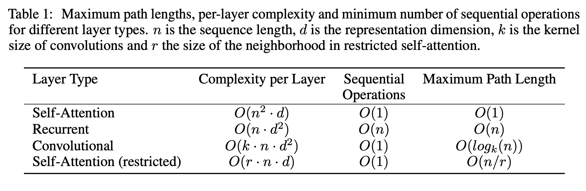

# BERT Background

## Index
- [Introduction](#introduction)
- [BERT Summary](#bert-summary)
- [Attention Paper](#transformer-paper)
- [BERT Paper](#bert-paper)
- [BERT Variants](#bert-variants)

---

## Introduction
- 자연어 처리에서 가장 유명한 언어 모델 중 하나인 BERT에 대해 다뤄보자는 취지로 해당 분석을 진행합니다.
- BERT의 근간이 되는 Attention Mechanism에 대한 논문을 선행적으로 알아보고,   
  BERT에 대한 논문을 살펴봅니다.
- 한눈에 BERT에 대해 이해할 수 있도록 필요한 내용을 정리하여 요약합니다.
- BERT로부터 파생된 다른 모델들을 비교하고 정리합니다.
- 별도의 노트북 파일에서 Transformer 및 BERT에 대한 코드 분석을 수행합니다.
- 해당 문서는 필요에 의하여 지속적으로 업데이트 됩니다.

---

## Attention Paper

> **Attention Is All You Need**   
> CVPR 2017 · Ashish Vaswani et al.

<a href="https://arxiv.org/pdf/1706.03762.pdf"><button type="button" class="btn btn-primary">Paper Link</button></a>

### 1. Introduction

- RNN은 시퀀스 모델링에서 SOTA를 성립했고, 그 경계를 넘어서려는 시도가 수차례 있어왔습니다.
- 순환 모델은 일반적으로 입출력 시퀀스의 위치를 계산하는데,   
이는 길이가 긴 시퀀스에서 메모리 제한이라는 문제와 직면하게 됩니다.
- 최근엔 factorization tricks나 conditional computation 등의 기법으로 계산 효율을 증가시켰지만,   
여전히 시퀀스 계산 그 자체에 대한 문제가 남아있습니다.
- 어텐션 메커니즘은 입출력 시퀀스 길이에 대한 의존성을 제거하여,   
향후 시퀀스 모델링에 있어서 필수적인 요소가 될 것입니다.
- 해당 연구에서는 순환이 아닌, 어텐션 메커니즘으로만 구성된 트랜스포머 구조를 제안합니다.

### 2. Background

- 순환 시퀀스 계산의 목표는 모든 입출력 위치에 대한 은닉 표현을 계산하는 CNN 블록의 기반을 형성하는 것입니다.
- 트랜스포머에서 연산의 수를 줄였으며, 평균 어텐션 가중치에 의해 비용이 줄어드는 문제를   
Multi-Head Attention으로 해결했습니다.
- Self-attention은 시퀀스의 표현을 계산하기 위해 단일 시퀀스를 다양한 관점에서 바라보는 것입니다.
- 트랜스포머의 의의는 RNN을 완전히 배제하고 self-attention만을 사용하는 것에 있습니다.

### 3. Model Architecture

- 트랜스포머는 기존 인코더-디코더 구조에서 이전 입력의 결과를 추가적인 입력으로 사용하는 과정을   
중첩된 self-attention과 point-wise를 사용해 구현합니다.

#### 3.1. Encoder and Decoder Stacks

**Encoder**

- 인코더는 6개 층으로 구성되며, 각각의 층은 2개의 sub-layers를 가집니다.
- 첫번째 sub-layer는 multi-head self-attention 메커니즘이며, 두번쨰는 point-wise 구조입니다.
- 각각의 sub-layer는 $LayerNorm(x+Sublayer(x))$로 표현되며,   
모든 층은 $d_{model}$로 설정된 값과 동일한 512차원의 벡터를 반환합니다.

**Decoder**

- 디코더도 마찬가지로 6개 층으로 구성되며, 인코더와 같은 2개의 sub-layers에 하나의 sub-layer를 추가합니다.
- 추가된 세번째 sub-layer는 인코더 결과에 대해 multi-head attention을 수행합니다.

#### 3.2. Attention

- 어텐션 함수는 query를 key-value 쌍과 맵핑한 결과로 표현할 수 있습니다.
- query, keys, values, 결과는 모두 벡터이며, 결과는 values의 가중합으로 계산됩니다.

#### 3.2.1. Scaled Dot-Product Attention

- query와 key에 대해 내적한 결과에 softmax 함수를 적용하고, value와 가중합을 진행합니다.

$$
Attention(Q,K,V)=softmax(\frac{QK^T}{\sqrt{d_k}})V
$$

- Dot-product attention은 매우 빠르고 공간 효율적이지만,   
$d_k$의 크기가 커질수록 내적 결과가 증폭되어버리기 때문에 스케일을 적용했습니다.

#### 3.2.2. Multi-Head Attention

- 각각의 key, value, query에 어텐션 함수를 적용시키기보다,   
이를 행렬로 만들어 한번에 어텐션 함수를 적용시키는 것이 더 효율적입니다.
- Multi-head attention은 모델이 서로 다른 관점에서 바라본 다른 표현의 정보를 합치게 합니다.

$$
MultiHead(Q,K,V)=Concat(head_1,...,head_h)W^O
$$

#### 3.2.3. Applications of Attentino in out Model

- 트랜스포머는 세 가지 방식으로 multi-head attention을 사용합니다:

1. 인코더-디코더 어텐션 층에서, 디코더가 입력 시퀀스의 시점에 집중할 수 있게하기 위한 용도로 사용됩니다.
2. 인코더는 self-attention 층을 포함하며, key, value, query가 동일한 값을 가집니다.
3. 디코더도 self-attention 층을 포함합니다.

#### 3.3. Position-wise Feed-Forward Networks

- 어텐션에서 각각의 sub-layers는 ReLU 활성화 함수가 적용되는 Position-wise FFN입니다.

$$
FFN(x)=max(0,xW_1+b_1)W_2+b_2
$$

#### 3.4. Embeddings and Softmax

- 시퀀스 모델과 비슷하게 입출력 토큰을 벡터로 변환하기 위해 임베딩을 학습했습니다.
- 또한, 디코더 출력으로 다음 토큰의 확률을 예측하기 위해 softmax 함수를 사용했습니다.

#### 3.5. Positional Encoding

- 트랜스포머는 시퀀스의 순서를 만들어내기 위해 positional encodings을 추가했습니다.
- 사인, 코사인 함수를 사용해 시퀀스 내 토큰의 위치를 표시했습니다.

### 4. Why Self-Attention

- 층의 복잡도 측면과 병렬 연산의 총량의 측면에서 순환 또는 합성곱 모델보다 뛰어납니다.
- 길이가 긴 문장을 학습하는데 탁월합니다.

    

### 5. Training

#### 5.1. Training Data and Batching

- 4.5백만개의 문장 조합이 있는 WMT 2014 English-German 데이터셋을 사용했습니다.
- 문장은 byte-pair encoding을 적용하여 37000개의 토큰으로 구성했습니다.
- English-French 데이터는 36백만개의 문장과 32000개의 word-piece 토큰으로 구성했습니다.
- 각각의 batch는 25000개의 원본 토큰과 25000개의 번역 토큰의 조합으로 구성했습니다.

### 5.2. Hardware and Schedule

- 8 NVIDIA P100 GPUs 상에서 학습했습니다.
- base 모델은 12시간 동안 100000번, large 모델은 3.5일 동안 300000번에 달하는 학습 진행했습니다.

### 5.3. Optimizer

- Adam 옵티마이저를 사용하고, 점진적으로 learning rate를 상승하게 설정했습니다.

### 5.4. Regularization

- Residual Dropout과 Label Smoothing을 적용해 정확도 및 BLEU 스코어를 향상시켰습니다.

    

## 6. Results

### 6.1. Machine Translation

- English-to-German 번역 작업에서 새로운 SOTA에 해당하는 BLEU 스코어 28.4를 달성했습니다.
- English-to-French 번역에서는 마찬가지로 large 모델이 BLEU 스코어 41.0을 달성했습니다.

### 6.2. Model Variations

- 트랜스포머 각 구성요소의 중요성을 평가하기 위해, base 모델을 다양한 방식으로 측정했습니다.

    

### 6.3. English Constituency Parsing

- 트랜스포머가 영어 문장 성분을 구분할 수 있는지 확인하기 위해 평가했습니다.

    

### 7. Conclusion

- 어텐션만으로 구성된 최초의 시퀀스 모델인 트랜스포머를 소개했습니다.
- 번역 작업에서 트랜스포머는 순환 또는 합성곱 층 기반 구조와 비교했을 때 매우 빠르게 학습하였고,   
SOTA에 달하는 성능을 보였습니다.
- 트랜스포머를 텍스트 뿐 아니라, 이미지, 오디오, 동영상의 영역까지 확대할 계획입니다.

---

## BERT Paper

> **BERT: Pre-training of Deep Bidirectional Transformers for Language Understanding**   
> CVPR 2018 · Jacob Devlin, Ming-Wei Chang, Kenton Lee, Kristina Toutanova

<a href="https://arxiv.org/pdf/1810.04805.pdf"><button type="button" class="btn btn-primary">Paper Link</button></a>

### 1. Introduction

- 언어 모델 사전학습은 문장 간의 관계를 예측하는 것을 목적으로 다양한 자연어 처리 작업에 효과적으로 기여했습니다.
- 사전학습된 언어 표현을 적용하는데 있어서 두 가지 전략(*feature-based*, *fine-tuning*)이 존재합니다.
- **Feature-based approach(ELMo)**는 사전학습된 표현의 특징을 포함하는 task-specific 아키텍처를 사용합니다.
- **Fine-tuning approach(OpenAI GPT)**는 모든 사전학습된 파라미터를 fine-tuning합니다.
- 두 접근 방식은 모두 단방향으로 언어 표현을 학습하는 동일한 목적 함수를 이용하는데,   
이는 문장 수준의 작업에만 최적화되는 제한을 걸어 토큰 수준의 접근 방식에 적용하기 어려울 수 있습니다.
- 해당 논문에서는 Masked Language Model(MLM)을 사용하는 양방향 학습 기법 **BERT**를 소개합니다.
- **MLM**은 문장 내 일부 토큰을 랜덤하게 가려서 원본 단어를 예측하게 하는 목적 함수입니다.

### 2. Related Work

#### 2.1. Unsupervised Feature-based Approaches

- Word embedding 및 문맥상 잘못된 단어를 올바르게 식별하기 위해 left-to-right 언어 모델링을 적용했습니다.
- ELMo는 LSTM을 통해 left-to-right 및 right-to-left 표현에서 문맥적 특징을 파악하여,   
question answering, sentiment analysis, named entity recognition 등에서 성능 향상을 일으켰습니다.

#### 2.2. Unsupervised Fine-tuning Approaches

- 분류되지 않은 텍스트로부터 word embedding 파라미터를 사전학습 하였습니다.
- 처음부터 소수의 파라미터만 요구된다는 장점을 가져 문장 수준 작업에서 성능 향상을 일으켰습니다.

#### 2.3. Transfer Learning from Supervised Data

- 방대한 데이터셋을 가지고 지도 학습을 거친 작업에 대한 전이 학습을 거치는 연구도 존재합니다.
- Computer Vision 분야에서 ImageNet과 같이 사전 학습된 모델에 대한 전이 학습의 중요성을 알렸습니다.

### 3. BERT

- 분류되지 않은 데이터를 가지고 사전 학습을 진행한 후,   
분류된 데이터를 활용해 모든 파라미터를 fine-tuning 하는 작업을 거쳤습니다.

#### Model Architecture

- [Vaswani 등이 발표](https://arxiv.org/abs/1706.03762)한 구조를 기반으로 다층 양방향 변환 인코더를 적용시킨 아키텍처입니다.
- 레이어의 개수에 따라 $BERT_{BASE}$와 $BERT_{LARGE}$로 구분했습니다.
- $BERT_{BASE}$는 OpenAI GPT와 같은 사이즈를 가지고 있지만 양방향 방식을 사용했습니다.

#### Input/Output Representations

- 단일 문장과 질문/답변 등 짝지어진 문장을 확실하게 표현할 수 있는 데이터를 다루게 했습니다.
- 30000개의 토큰 단어를 가지고 있는 WordPiece embedding을 사용했습니다.
- 모든 문장의 첫번째 토큰은 분류 토큰 `[CLS]`, 마지막 토큰은 A 또는 B 문장에 속하는지 알리는 토큰 `[SEP]`입니다.
- 대응되는 토큰, segment와 position embedding을 합산해 입력 데이터의 표현을 구성했습니다.

#### Task #1: Masked LM

- 일반적인 언어 모델에서 양방향 조건을 적용하면 각 단어의 방향성을 상실하여 예측 성능이 떨어지기 때문에,   
일정 비율의 토큰을 랜덤하게 숨겨서 이를 예측하도록 할 필요가 있습니다.
- WordPiece의 각 문장에서 15%의 토큰을 가리고 해당 단어들만 예측하도록 설정했습니다.
- Fine-tuning에서 [MASK] 토큰이 나타나지 않아 사전 학습된 것과 맞지 않는 문제가 생길 수 있기 때문에,   
[MASK] 토큰을 가지고 있는 단어 중에서 일부만 가리도록 적용시켜서 cross entropy loss를 파악했습니다.

#### Task #2: Next Sentence Prediction (NSP)

- 대다수의 NLP 과제는 두 문장 간의 관계를 파악하는데 집중하기 때문에,   
어떠한 단일 언어 말뭉치로부터 다음 문장을 예측할수 있도록 사전 학습을 진행했습니다.

#### Pre-training data

- 실존하는 문학적 표현을 학습시키기 위해 BooksCorpus 및 Wikipedia의 단어를 사용했습니다.
- Wikipedia로부터는 리스트나 테이블 등은 무시한채 구절만 추출했습니다.

#### Fine-tuning BERT

- 일반적으로는 양방향 관계를 확인하기 전에 텍스트 짝을 각각 독립적으로 인코딩하지만,   
BERT는 두 텍스트를 결합하여 인코딩을 진행했습니다.
- Pre-training과 비교해서, fine-tuning은 상대적으로 시간 등의 자원을 덜 소비합니다.

### 4. Experiments

#### 4.1. GLUE

- GLUE benchmark는 다양한 자연어를 얼마나 잘 이해하는지 평가하는 기준입니다.
- Batch size 32, 3 epochs를 적용해 GLUE 작업을 진행했을 때,   
$BERT_{LARGE}$의 fine-tuning이 불안정적인 것을 확인하고 데이터를 shuffle하여 랜덤하게 재시작했습니다.
- $BERT_{BASE}$와 $BERT_{LARGE}$ 모두 기존의 SOTA와 비교했을 때,   
4.5%에서 7.0% 정도의 평균 정확도 상승을 확인했습니다.
- 매우 작은 학습 데이터를 가지고도 $BERT_{LARGE}$가 $BERT_{BASE}$보다 매우 높은 성능을 보였습니다.

    

#### 4.2. SQuAD v1.1

- SQuAD v1.1은 대중으로부터 수집한 100k 개의 질문/답변 모음으로, 답변 텍스트를 예측하기 위한 목적을 가집니다.
- 목적 함수는 문장의 시작부터 끝 부분의 정확성에 대한 로그 log-likelihoods 합을 사용하며,   
3 epochs, learning rate 5e-5, batch size 32를 가지고 fine-tuning을 진행했습니다.
- Ensemble에서는 +1.5 F1, 단일 BERT에서는 +1.3 F1의 상승을 가져왔으며,   
TriviaQA fine-tunning 데이터를 제외한 경우에서는 0.1-0.4 F1의 손실만 발생시켰습니다.

#### 4.3. SQuAD v2.0

- SQuAD 1.1에 주어진 문장에서 짧은 답변이 아닐 수도 있는 가능성을 부여한 확장된 작업입니다.
- TriviaQA를 사용하지 않고, 2 epochs, learning rate 5e-5, batch size 48을 적용하여 fine-tuning을 수행했습니다.
- 기존의 결과와 비교했을 때 +5.1 F1의 상승을 확인했습니다.

   

   

#### 4.4. SWAG

- SWAG 데이터셋은 113k 개의 완성된 문장이 짝지어진 것으로,   
네 가지 선택지 중에서 가장 그럴듯한 다음 문장을 찾기 위한 목적을 가집니다.
- 3 epochs, learning rate 2e-5, batch size 16을 가지고 fine-tuning 했을 때,   
$BERT_{LARGE}$가 ESIM+ELMo보다 +27.1%, OpenAI GPT보다는 +8.3%의 향상을 보여주었습니다.

   

### 5. Ablation Studies

#### 5.1. Effect of Pre-training Tasks

- SQuAD에서 LTR 모델은 토큰 예측 능력이 떨어지기 때문에,   
랜덤하게 초기화된 BiLSTM을 상단에 적용하여 SQuAD의 결과를 개선시켰습니다.
- ELMo처럼 LTR과 RTL 모델을 각각 학습하고 합치는 것이 가능하다는 것을 인식했지만,   
단일 양방향 모델에 비해 두 배의 비용이 나가고, 모든 레이어에서 좌우 문맥을 사용해 성능도 떨어지는 문제가 있습니다.

#### 5.2. Effect of Model Size

- GLUE 작업에서 확인되는 것과 같이, 작은 데이터셋을 포함하는 모든 경우에 대해   
큰 사이즈의 모델이 높은 정확도 향상을 나타냈습니다.

### 6. Conclusion

- 언어 모델의 전이 학습을 통한 발전은 비지도 사전 학습이 언어를 이해하는 시스템에서 중요하다는 것을 증명했습니다.
- 적은 자원을 활용한 작업에서도 깊은 양방향 아키텍처가 장점을 가진다는 결과를 제시했습니다.
- 사전 훈련된 모델이 광범위한 NLP 작업을 성공적으로 수행하는데 기여했다 판단했습니다.
