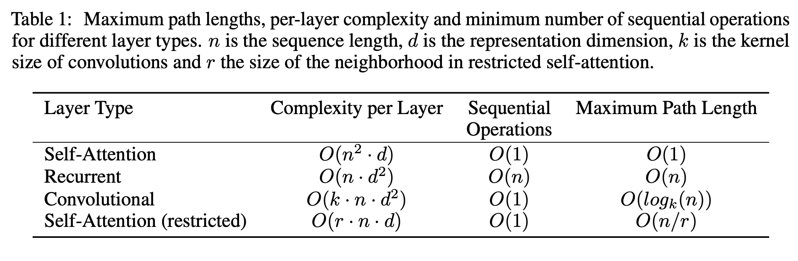
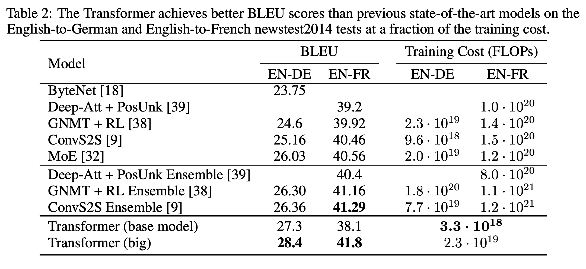
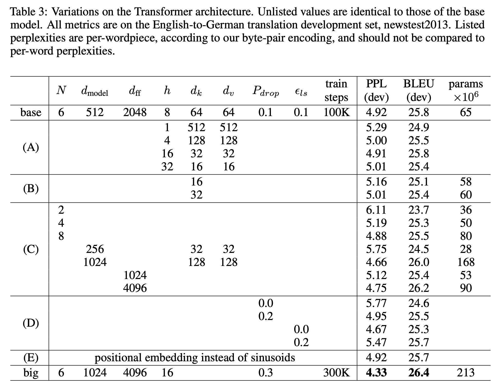
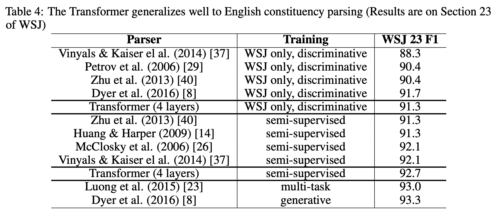

# Transformer Background

## Index
- [Introduction](#introduction)
- [Transformer Summary](#transformer-summary)
- [Transformer Paper](#transformer-paper)
- [Language Models](#language-models)

---

## Introduction
- 자연어 처리에서 거대 언어 모델의 근간이 되는 Transformer의 구조에 대해 다뤄보자는 취지로 해당 분석을 진행합니다.
- Transformer와 Attention Mechanism에 대한 논문을 알아보고,   
  Transformer의 인코더-디코더 구조를 세부적으로 파악하여 정리합니다.
- Transformer를 기반으로 하는 다양한 언어 모델을 비교합니다.
- 별도의 노트북 파일에서 Transformer 및 BERT에 대한 코드 분석을 수행합니다.
- 해당 문서는 필요에 의하여 지속적으로 업데이트 됩니다.

---

## Transformer Summary
- Encoder-Decoder 구조로 이루어져 있으며 각각에 대한 자세한 설명은 아래와 같습니다.
- loss function으로 cross-entropy loss를 사용해 분포의 차이를 확인합니다.
- optimizer로는 Adam을 사용하고, 과적합 방지를 위해 각 서브레이어 출력에 dropout이 적용됩니다.

### Encoder

- **Embedding**은 각각의 단어를 표현하는 벡터값으로, [문장 길이 x 임베딩 차원]으로 구성되어 있습니다.
- **Self Attention**은 입력 행렬에 가중치 행렬을 곱한 Q, K, V를 가지고 유사도를 계산하며,   
  (1)Q와 K^T 행렬의 내적 연산, (2)QK^T 행렬을 K 벡터 차원의 제곱근값으로 나누어 안정적인 gradient 도출,   
  (3)softmax 함수를 사용해 유사도 값을 정규화, (4)앞선 결과인 스코어 행렬에 V 행렬을 곱해 어텐션(Z) 행렬 계산의   
  순서를 가지며, 결과인 어텐션 행렬을 통해 단어가 문장 내 다른 단어와 얼마나 연관성이 있는지를 알 수 있습니다.
- Query는 현재 단어, Key는 연관성 있는 단어를 찾기 위한 라벨, Value는 실제 단어의 표현을 의미합니다.
- **Multi-Head Attention**은 문장 내에서 모호한 의미를 가진 단어가 잘못 해석될 경우를 보완하기 위해,   
  서로 다른 가중치 행렬로 다수의 어텐션 행렬을 구하고, 이들을 concatenate한 행렬에 새로운 가중치 행렬을 곱하여,   
  멀티 헤드 어텐션 결과를 도출합니다. (concatenate 후 행렬 사이즈를 되돌리기 위해 가중치 행렬을 곱합니다.)
- **Positional Encoding**은 한번에 모든 단어를 병렬로 입력 받는 트랜스포머에서,   
  문장 내 단어의 위치를 나타내기 위한 인코딩으로 입력 임베딩 결과에 대해 주로 사인파 함수를 곱해서 생성합니다.
- **Feed Forward Network**는 2개의 dense layer와 ReLU 활성화 함수로 구성되며,   
  앞뒤로 residual 및 정규화에 대한 add와 norm을 추가해 멀티 헤드 어텐션 간 입력값과 출력값을 연결합니다.
- 모든 인코더는 구조적으로 동일하지만, 가중치를 공유하지는 않습니다.

#### Encoding Process
1. 입력값을 입력 임베딩으로 변환한 다음 위치 인코딩을 추가하고, 가장 아래 있는 인코더 1의 입력값으로 공급합니다.
2. 인코더 1은 입력값을 받아 멀티 헤드 어텐션의 서브 레이어에 값을 보내고, 결과로 어텐션 행렬을 출력합니다.
3. 어텐션 행렬의 값을 피드 포워드 네트워크에 입력해 인코더 1에 대한 최종 결과를 출력합니다.
4. 인코더 1의 출력값을 그 위에 있는 인코더 2에 입력값으로 제공합니다.
5. 인코더 2에서도 이전과 동일한 방법을 통해 주어진 문장에 대한 인코더 표현 결과를 출력으로 제공합니다.

### Decoder

- 디코더에 대한 입력값과 인코더의 표현(출력값), 2개를 입력 데이터로 받습니다.
- t=1에서 디코더의 입력값으로 문장의 시작을 알리는 \<sos>가 전달되며, 타깃 문장의 첫 번째 단어가 생성됩니다.
- t=2에서 t-1 디코더에서 생성한 단어를 추가해 다음 단어를 생성하고,   
  디코더에서 \<eos> 토큰이 생성될 때까지 같은 과정을 반복하며 타깃 문장을 생성합니다.
- 디코더에서도 입력값을 바로 입력하지 않고 위치 인코딩을 추가한 값을 출력 임베딩에 더해 입력값으로 사용합니다.
- **Masked Multi-Head Attention**은 디코더가 이전 단계에서 생성한 단어만 입력으로 넣도록,   
  아직 예측하지 않은 오른쪽의 모든 단어를 $-\infin$에 해당하는 매우 작은 값으로 마스킹을 적용합니다.
- **Encoder-Decoder Attention Layer**에서는,   
  인코더의 표현값 R과 마스크된 멀티 헤드 어텐션의 결과 M에 대해 상호작용이 발생하며,   
  M은 Q를, R은 K, V를 생성하는데 활용되어 타깃 단어가 입력 문장의 모든 단어와 얼마나 유사한지 계산합니다.
- **Linear and Softmax Layer**에서는 최상위 디코더에서 얻은 출력 값이 전달되어,   
  logit을 확률값으로 변환되고 디코더에서 가장 높은 확률값을 갖는 인덱스의 단어를 출력합니다.

#### Decoding Process
1. 디코더에 대한 입력 문장을 임베딩 행렬로 변환하고, 위치 인코딩 정보를 추가해 디코더 1에 입력합니다.
2. 디코더 1은 입력값을 받아 마스크된 멀티 헤드 어텐션 레이어에 보내고, 출력으로 어텐션 행렬 M을 반환합니다.
3. 어텐션 행렬 M과 인코딩 표현 R을 멀티 헤드 어텐션의 입력으로 넣어, 새로운 어텐션 행렬을 생성합니다.
4. 인코더-디코더 어텐션 레이어에서 출력한 어텐션 행렬을 피드 포워드 네트워크에 입력해 디코더의 표현을 출력합니다.
5. 디코더 1의 출력값을 다음 디코더 2의 입력값으로 전달하면서 동일한 방법으로 타깃 문장에 대한 표현을 반환합니다.
6. 최종적으로 타깃 문장의 디코더 표현을 선형 및 소프트맥스 레이어에 입력해 가장 높은 확률값을 갖는 단어를 얻습니다.

### References
- [The Illustrated Transformer](https://jalammar.github.io/illustrated-transformer/)
- [Learning about the Attention Mechanism and the Transformer Model](https://deepfrench.gitlab.io/deep-learning-project/)
- [구글 BERT의 정석, Sudharsan Ravichandiran](https://www.aladin.co.kr/shop/wproduct.aspx?ItemId=281761569&start=slayer)
- [08-2: Transformer, 고려대학교 산업경영공학부 DSBA 연구실](https://youtu.be/Yk1tV_cXMMU)

---

## Transformer Paper

> **Attention Is All You Need**   
> 2017 · Ashish Vaswani et al.

<a href="https://arxiv.org/pdf/1706.03762.pdf"><button type="button" class="btn btn-primary">Paper Link</button></a>

### 1. Introduction

- RNN은 시퀀스 모델링에서 SOTA를 성립했고, 그 경계를 넘어서려는 시도가 수차례 있어왔습니다.
- 순환 모델은 일반적으로 입출력 시퀀스의 위치를 계산하는데,   
이는 길이가 긴 시퀀스에서 메모리 제한이라는 문제와 직면하게 됩니다.
- 최근엔 factorization tricks나 conditional computation 등의 기법으로 계산 효율을 증가시켰지만,   
여전히 시퀀스 계산 그 자체에 대한 문제가 남아있습니다.
- 어텐션 메커니즘은 입출력 시퀀스 길이에 대한 의존성을 제거하여,   
향후 시퀀스 모델링에 있어서 필수적인 요소가 될 것입니다.
- 해당 연구에서는 순환이 아닌, 어텐션 메커니즘으로만 구성된 트랜스포머 구조를 제안합니다.

### 2. Background

- 순환 시퀀스 계산의 목표는 모든 입출력 위치에 대한 은닉 표현을 계산하는 CNN 블록의 기반을 형성하는 것입니다.
- 트랜스포머에서 연산의 수를 줄였으며, 평균 어텐션 가중치에 의해 비용이 줄어드는 문제를   
Multi-Head Attention으로 해결했습니다.
- Self-attention은 시퀀스의 표현을 계산하기 위해 단일 시퀀스를 다양한 관점에서 바라보는 것입니다.
- 트랜스포머의 의의는 RNN을 완전히 배제하고 self-attention만을 사용하는 것에 있습니다.

### 3. Model Architecture

- 트랜스포머는 기존 인코더-디코더 구조에서 이전 입력의 결과를 추가적인 입력으로 사용하는 과정을   
중첩된 self-attention과 point-wise를 사용해 구현합니다.

#### 3.1. Encoder and Decoder Stacks

**Encoder**

- 인코더는 6개 층으로 구성되며, 각각의 층은 2개의 sub-layers를 가집니다.
- 첫번째 sub-layer는 multi-head self-attention 메커니즘이며, 두번쨰는 point-wise 구조입니다.
- 각각의 sub-layer는 $LayerNorm(x+Sublayer(x))$로 표현되며,   
모든 층은 $d_{model}$로 설정된 값과 동일한 512차원의 벡터를 반환합니다.

**Decoder**

- 디코더도 마찬가지로 6개 층으로 구성되며, 인코더와 같은 2개의 sub-layers에 하나의 sub-layer를 추가합니다.
- 추가된 세번째 sub-layer는 인코더 결과에 대해 multi-head attention을 수행합니다.

#### 3.2. Attention

- 어텐션 함수는 query를 key-value 쌍과 맵핑한 결과로 표현할 수 있습니다.
- query, keys, values, 결과는 모두 벡터이며, 결과는 values의 가중합으로 계산됩니다.

#### 3.2.1. Scaled Dot-Product Attention

- query와 key에 대해 내적한 결과에 softmax 함수를 적용하고, value와 가중합을 진행합니다.

$$
Attention(Q,K,V)=softmax(\frac{QK^T}{\sqrt{d_k}})V
$$

- Dot-product attention은 매우 빠르고 공간 효율적이지만,   
$d_k$의 크기가 커질수록 내적 결과가 증폭되어버리기 때문에 스케일을 적용했습니다.

#### 3.2.2. Multi-Head Attention

- 각각의 key, value, query에 어텐션 함수를 적용시키기보다,   
이를 행렬로 만들어 한번에 어텐션 함수를 적용시키는 것이 더 효율적입니다.
- Multi-head attention은 모델이 서로 다른 관점에서 바라본 다른 표현의 정보를 합치게 합니다.

$$
MultiHead(Q,K,V)=Concat(head_1,...,head_h)W^O
$$

#### 3.2.3. Applications of Attentino in out Model

- 트랜스포머는 세 가지 방식으로 multi-head attention을 사용합니다:

1. 인코더-디코더 어텐션 층에서, 디코더가 입력 시퀀스의 시점에 집중할 수 있게하기 위한 용도로 사용됩니다.
2. 인코더는 self-attention 층을 포함하며, key, value, query가 동일한 값을 가집니다.
3. 디코더도 self-attention 층을 포함합니다.

#### 3.3. Position-wise Feed-Forward Networks

- 어텐션에서 각각의 sub-layers는 ReLU 활성화 함수가 적용되는 Position-wise FFN입니다.

$$
FFN(x)=max(0,xW_1+b_1)W_2+b_2
$$

#### 3.4. Embeddings and Softmax

- 시퀀스 모델과 비슷하게 입출력 토큰을 벡터로 변환하기 위해 임베딩을 학습했습니다.
- 또한, 디코더 출력으로 다음 토큰의 확률을 예측하기 위해 softmax 함수를 사용했습니다.

#### 3.5. Positional Encoding

- 트랜스포머는 시퀀스의 순서를 만들어내기 위해 positional encodings을 추가했습니다.
- 사인, 코사인 함수를 사용해 시퀀스 내 토큰의 위치를 표시했습니다.

### 4. Why Self-Attention

- 층의 복잡도 측면과 병렬 연산의 총량의 측면에서 순환 또는 합성곱 모델보다 뛰어납니다.
- 길이가 긴 문장을 학습하는데 탁월합니다.

    

### 5. Training

#### 5.1. Training Data and Batching

- 4.5백만개의 문장 조합이 있는 WMT 2014 English-German 데이터셋을 사용했습니다.
- 문장은 byte-pair encoding을 적용하여 37000개의 토큰으로 구성했습니다.
- English-French 데이터는 36백만개의 문장과 32000개의 word-piece 토큰으로 구성했습니다.
- 각각의 batch는 25000개의 원본 토큰과 25000개의 번역 토큰의 조합으로 구성했습니다.

### 5.2. Hardware and Schedule

- 8 NVIDIA P100 GPUs 상에서 학습했습니다.
- base 모델은 12시간 동안 100000번, large 모델은 3.5일 동안 300000번에 달하는 학습 진행했습니다.

### 5.3. Optimizer

- Adam 옵티마이저를 사용하고, 점진적으로 learning rate를 상승하게 설정했습니다.

### 5.4. Regularization

- Residual Dropout과 Label Smoothing을 적용해 정확도 및 BLEU 스코어를 향상시켰습니다.

    

## 6. Results

### 6.1. Machine Translation

- English-to-German 번역 작업에서 새로운 SOTA에 해당하는 BLEU 스코어 28.4를 달성했습니다.
- English-to-French 번역에서는 마찬가지로 large 모델이 BLEU 스코어 41.0을 달성했습니다.

### 6.2. Model Variations

- 트랜스포머 각 구성요소의 중요성을 평가하기 위해, base 모델을 다양한 방식으로 측정했습니다.

    

### 6.3. English Constituency Parsing

- 트랜스포머가 영어 문장 성분을 구분할 수 있는지 확인하기 위해 평가했습니다.

    

### 7. Conclusion

- 어텐션만으로 구성된 최초의 시퀀스 모델인 트랜스포머를 소개했습니다.
- 번역 작업에서 트랜스포머는 순환 또는 합성곱 층 기반 구조와 비교했을 때 매우 빠르게 학습하였고,   
SOTA에 달하는 성능을 보였습니다.
- 트랜스포머를 텍스트 뿐 아니라, 이미지, 오디오, 동영상의 영역까지 확대할 계획입니다.

---

## Language Models

### Summary

<table>
  <tr><th width="33%" align="center">Seq2Seq</th><th width="33%" align="center">Attetion+Seq2Seq</th><th width="33%" align="center">Transformer</th></tr>
  <tr>
    <td align="center">인코더-디코더 구조</td>
    <td align="center">디코더가 source sentence의 중요한 정보에 집중</td>
    <td align="center">Self Attention, Multi-head Attention</td>
  </tr>
  <tr><th align="center">GPT-1</th><th align="center">BERT</th><th align="center">GPT-2</th></tr>
  <tr>
    <td align="center">사전 학습을 통해 언어 자체를 이해</td>
    <td align="center">Bidirectional하게 맥락을 파악</td>
    <td align="center">Zeroshot 전이 학습</td>
  </tr>
  <tr><th align="center">XLNet</th><th align="center">RoBERTa</th> <th align="center">MASS</th> </tr>
  <tr>
    <td align="center">BERT와 GPT를 합친 구조로 AR 공식을 통해 BERT 한계 극복</td>
    <td align="center">가장 최적화된 BERT</td>
    <td align="center">인코더와 디코더에 상반된 masking</td>
  </tr>
  <tr><th align="center">BART</th><th align="center">MT-DNN</th> <th align="center">T5</th></tr>
  <tr>
    <td align="center">인코더에 다양한 noising 추가</td>
    <td align="center">Multitask learning을 통해 일반적인 표현 생성</td>
    <td align="center">모든 NLP task를 통합</td>
  </tr>
</table>

### [XLNet](https://arxiv.org/pdf/1906.08237.pdf)
- **Auto Encoding(AE)**는 어떤 값을 복원해내는 것에 목적이 있습니다.   
  (BERT는 denoising AE라 볼 수 있습니다.)
- **Auto Regressive(AR)**은 word sequence에 대해 순차적으로 likelihood를 계산하는 것입니다.
- AE는 mask 토큰을 독립적으로 예측할 수 없어 토큰 간 dependency를 학습할 수 없는 문제가 있고,   
  AR은 단일 방향 정보만 이용하여 학습 가능한 단점이 있습니다.
- XLNet은 AE과 AR의 장점은 살리고 단점은 보완했고, 그 방법으로는 아래 세가지가 있습니다.
- **Permutation Language Modeling Objective**는 input sequence에 대해,   
  permutation 집합을 생성하고 모든 집합에 AR formula(likelihood)를 적용합니다.
- permutation 집합으로 다양한 sequence를 통한 양방향 context를 고려하여 AR의 한계를 극복하고,   
  masking을 제거하여 AE의 한계를 극복했습니다.
- **Target-Aware Representation**은 새로운 objective function을 적용하기 위해 제안되었으며,   
  학습 시 permutation으로 인해 예측할 토큰이 명확하지 않은 문제에 대한 해결방안으로,   
  예측할 representation과 target 토큰을 함께 학습하게 됩니다.
- **Two-Straem Self-Attention**은 변경된 representation을 self attention에 적용하기 위해,   
  T 시점 이전과 T 시점 이후의 context를 모두 고려하도록 2가지 hidden representation을 사용합니다.
- 위 방식은 t 시점 이전의 토큰 정보와 t 시점의 위치 정보에 대한 **query representation**과,   
  t 시점과 t 이전 시점의 토큰 정보에 대한 일반적인 **context representation**으로 나눠집니다.
- Transformer-XL 논문을 참고한 구조
- permutation 집합이 많아지는 문제를 해결하기 위해 sampling을 진행하고 마지막 K개의 예측만 사용

### [RoBERTa](https://arxiv.org/pdf/1907.11692.pdf)
- BERT의 구조적 변화 없이 모델의 학습시간, batch 사이즈, train data를 증가시켰습니다.
- 또한, NSP task를 제거하고 longer sequence를 추가했습니다.
- masking pattern을 dynamic하게 하여, 똑같은 데이터에 대해 masking을 10번 다르게 적용해 학습했습니다.

### [MASS](https://arxiv.org/pdf/1905.02450.pdf)
- XLNet 구조를 그대로 가져오면서 masking 방법을 다르게 한 모델입니다.
- 인코더 입력 중 일부 fragment에 masking을 적용하며, 디코더에서는 예측할 토큰들을 auto-regressive하게 입력하면서,   
  인코더에서 masking을 하지않은 토큰을 masking하여 입력합니다.
- 인코더와 디코더의 masking을 반대로 하여 두가지가 상호의존적으로 학습할 수 있게 합니다.
- K는 masking할 fragment의 길이에 대한 파라미터로, K=1일 경우 BERT, K=m일 경우 GPT의 방식과 유사합니다.

### [BART](https://arxiv.org/pdf/1910.13461.pdf)
- MASS와 비슷하지만 bidirectional하게 auto-regressive transformer를 진행합니다.
- 인코더 입력에만 noise를 가해주며, noise 방법론엔 5가지가 존재합니다.
- **Token Masking**은 임의의 토큰을 [MASK]로 교체하고 [MASK] 토큰이 무엇인지 예측하는 것입니다.
- **Token Deletion**은 임의의 토큰을 삭제하고 삭제한 토큰의 위치를 찾는 것입니다.
- **Text Infilling**은 poisson 분포를 따르는 span length를 뽑아 하나의 [MASK] 토큰으로 대체하고,   
  [MASK]로 대체된 토큰에 몇 개의 토큰이 존재할지를 예측하는 것입니다.
- **Sentence Permutation**은 문장의 순서를 랜덤으로 섞는 것입니다.
- **Document Rotation**은 하나의 토큰을 시작점으로 회전시키고 원래 문서의 시작점을 찾는 것입니다.
- Text Infilling 노이즈 방법을 사용했을 때 가장 높은 성능을 보였습니다.

### [MT-DNN](https://arxiv.org/pdf/1901.11504.pdf)
- BERT에 Multi-task learning을 적용한 것입니다.
- **Multi-task learning**은 이전 task로부터 학습된 지식이 다음 task 학습을 도와 성능 향상이 이루어질 것이라 기대하는 것입니다.
- related task로부터 모인 많은 양의 supervised data를 활용해 학습할 수 있고,   
  single modelfh 여러가지 task를 학습하여 regularization 효과를 줄 수 있습니다.
- pre-train 단에서 task를 학습하기 위해 특정 task에 대한 mini-batch에서 랜덤하게 데이터를 선택하고,   
  선택된 task에 맞는 loss function을 구성하여 오차 전파를 수행합니다.
- MT-DNN은 데이터 양이 적을 때 BERT 대비 높은 성능을 보입니다.

### [T5](https://arxiv.org/pdf/1910.10683.pdf)
- 여러가지 task를 텍스트로 바꾸고 그로부터 텍스트를 뱉어내는 unified framework를 생성하는 것이 T5의 목표입니다.
- **text-to-text**는 text 형태로 주어진 문제에서 text 정답을 찾는 것으로,   
  task 자체를 학습하기 위해 input에 태스크에 대한 텍스트(cola, sst2 등)을 명시합니다.
- BERT의 경우 인코더만 존재해 텍스트 입력에 대해 classification 또는 span prediction만 수행할 수 있지만,   
  T5는 모든 NLP task에서 동일한 모델, loss, hyperparameter를 사용할 수 있습니다.
- BERT나 GPT 같은 인코더, 디코더만 존재하는 구조보다 basic transformer 구조가 높은 성능을 보였습니다.
- pre-training에서 noising된 input을 denoising하며 단어를 예측하는 방식이 가장 효율적인 방법입니다.
- multi-task learning이 unsupervised pre-training과 비슷한 성능을 보였습니다.
- **Modified MLM**은 BART처럼 연속된 토큰을 하나의 mask로 바꾸면서, MASS의 방식으로 mask 되지 않은 부분을 target에서 맞춥니다.

### References
- [[Paper Review] Transformer to T5 (XLNet, RoBERTa, MASS, BART, MT-DNN,T5)](https://youtu.be/v7diENO2mEA)
