# YOLO Background

## Index
- [Introduction](#introduction)
- [YOLO Summary](#yolo-summary)
- [YOLOv1 Paper](#yolov1-paper)
- [YOLOv4 Paper](#yolov4-paper)
- [YOLOv7 Paper](#yolov7-paper)
- [History of YOLO](#history-of-yolo)
- [CNN Models](#cnn-models)

---

## Introduction
- 과거 [Dinut](https://github.com/minyeamer/dinut)이라는 식단 영양 분석 서비스를 제작한 적이 있었는데,   
  당시 객체 인식 모델로서 사용했던 YOLO에 대해 자세히 알아보고 싶은 취지를 가지고 해당 분석을 진행합니다.
- 초기 버전의 YOLO 모델에 대한 논문을 알아보고, YOLOv1부터 YOLOv6까지의 변화를 정리해봅니다.
- YOLO 모델 발전 과정을 알아보는 과정에서 중간 단계 모델에 대한 상세한 이해가 필요함을 느꼈고,   
  가장 다양한 데이터 처리 및 추론 기법이 적용된 YOLOv4 모델의 논문을 확인했습니다.
- 프로젝트 진행 당시의 YOLO 최신 버전은 v5였지만, 해당 모델에 대한 논문이 현재까지 존재하지 않는 점과,   
  2022년 8월인 현시점의 기준에서 YOLOv7까지 개발된 상태이기 때문에 최신 버전인 YOLOv7의 논문을 살펴봅니다.
- YOLO 논문을 분석하는 과정에서 이해하지 못한 부분을 다른 논문 리뷰를 참고하여 정리합니다.
- YOLO의 백본에 해당하는 CNN을 기반 이미지 분류 모델을 비교합니다.
- 별도의 노트북 파일에서 YOLOv7에 대한 코드 분석을 수행합니다.
- 해당 문서는 필요에 의하여 지속적으로 업데이트 됩니다.

---

## YOLO Summary

### Object Detection
- **Object Classification**: 이미지 내 single object의 class probability를 예측하는 작업입니다.
- **Object Localization**: 이미지 내 single object에 대한 분류와 bounding box를 탐지하는 작업입니다.
- **Object Detection**: 이미지 내 multiple object에 대한 분류와 bounding box를 탐지하는 작업입니다.
- **One-Stage Detector**: 이미지 내 모든 위치를 object의 잠재영역으로 보고 각 후보영역에 대해 예측합니다.
- **Two-Stage Detector**: localization > classification 순차적으로 수행하여 결과를 얻습니다.

### YOLO
- 이미지 전체로부터 얻은 feature map을 활용해 bbox를 예측하고 모든 클래스에 대한 확률을 계산합니다.
- SxS grid size, object 수 B, 클래스 수 C에 대해 SxSx(B*5+C) 크기의 output tensor를 가집니다.   
  (bbox 하나에 대해 $x,y,w,h,p_c$ 5개 output을 생성하며, $p_c$는 물체 내 bbox가 있을 확률입니다.)
- YOLOv1 기준 GooLeNet의 구조를 활용하여 24 conv layer + 2 fc layer로 구성되어 있고,   
  중간에 1x1 reduction layer를 추가해 conv layer의 증가로 인한 연산량 증가를 억제했습니다. ([참고](https://zzsza.github.io/data/2018/05/14/cs231n-cnn/))
- 각각의 grid cell마다 ground truth와 예측한 bbox 간의 IoU가 가장 높은 bbox 1개만 사용
- loss fuction은 MSE를 사용하며,   
  (1) 모든 grid cell에서 예측한 B개의 bbox 좌표와 GT box 좌표 간 오차,   
  (2) 모든 grid cell에서 예측한 B개의 $\text{Pr(Class|Object)}$와 GT 값,   
  (3) 모든 grid cell의 $\text{Pr(Object)*IOU}$ 예측값과 GT box 값의 합으로 계산됩니다.
- object 당 bbox 개수가 많이지는 것을 방지하기 위해 NMS(Non-Maximum Suppression)를 적용하여,   
  클래스 별로 각 object에 대해 예측한 bbox 중에서 가장 예측력 좋은 bbox만을 남깁니다.
- YOLOv2부터는 미리 정의된 anchor box를 사용하여 grid cell 마다 anchor box를 기반으로 예측을 수행합니다.
- YOLO 모델의 전체적인 구조는 Backbone, FPN, Head로 구성됩니다.

### Faster R-CNN
- two-stage detector로, sliding window 마다 9개의 anchor box를 생성해 object 위치를 파악합니다.
- CNN을 통해 얻은 feature map에서 앞서 예측된 box를 기반으로 classification, bbox 좌표를 예측합니다.
- one-stage detector 대비 성능은 높지만, 속도가 매우 느린 단점이 있습니다.

### References
- [[Paper Review] You Only Look Once : Unified, Real-Time Object Detection, 이윤승](https://youtu.be/O78V3kwBRBk)
- [[Paper Review] YOLO9000: Better, Faster, Stronger, 이윤승](https://youtu.be/vLdrI8NCFMs)
- [PR-270: PP-YOLO: An Effective and Efficient Implementation of Object Detector](https://youtu.be/7v34cCE5H4k)

---

## YOLOv1 Paper

> **You Only Look Once: Unified, Real-Time Object Detection**   
> 2015 · Joseph Redmon, Santosh Divvala, Ross Girshick, Ali Farhadi

<a href="https://arxiv.org/pdf/1506.02640v5.pdf"><button type="button" class="btn btn-primary">Paper Link</button></a>

### 1. Introduction
- 사람은 이미지를 한 번 본 것만으로 어떤 물체인지 인식할 수 있을 정도로 빠르고 정확한데,   
  이러한 알고리즘을 컴퓨터에 적용할 수 있다면 자율주행, 로봇 등의 기술 발전에 도움이 될 것입니다.
- 현재의 객체 인식 시스템은 이미지 내 다양한 위치에서 분류 작업을 수행하며,   
  DPM과 같은 모델 슬라이딩 윈도우 방식을 사용해 전체 이미지 내 특정 부분을 분석합니다.
- 최신 기법인 R-CNN은 이미지 내 bounding box를 예측하도록 하지만,   
  더욱 정교한 bounding box를 찾기 위해 반복적으로 평가하는 방식은 매우 느리고 최적화가 어렵습니다.
- YOLO는 객체 인식을 단일 회귀 문제로 정의하여 한번에 bounding box 예측과 분류를 할 수 있고,   
  해당 방식은 아래 그림과 같이 단일 CNN 모델이 동시에 예측 및 분류 작업을 수행하는 것입니다.

  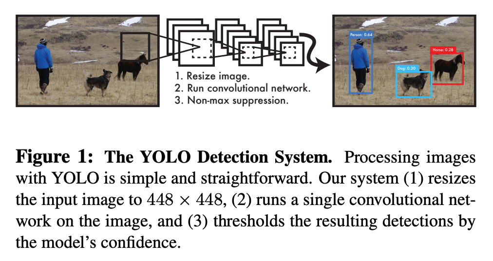

- YOLO는 Titan X GPU 환경에서 150 fps의 영상을 처리할 수 있을 정도로 빠르고,   
  전체 이미지를 한번에 분석하기 때문에 맥락을 이해할 수 있다는 장점이 있습니다.

### 2. Unified Detection
- YOLO는 객체 인식에서 분리되었던 요소들을 하나의 인공신경망으로 합침으로써,   
  전체 이미지의 feature를 사용해 각각의 bounding box를 예측하고 분류합니다.
- 해당 시스템은 이미지를 $SxS$ 그리드로 구분하고 객체의 중심점이 특정 cell에 들어오면,   
  객체를 인식했다고 판단합니다.
- 각각의 cell은 $\text{Pr(Object)}*\text{IOU}^\text{truth}_\text{pred}$ 식으로 boudning box에 대한 confidence를 예측하며,   
  truth와 pred의 합집합에 대한 교점이 같아지기 위한 confidence score를 평가합니다.
- 각각의 bounding box는 $x,y,w,h$ 및 confidence로 구성되어 있으며,   
  $(x,y)$는 객체의 중심점, $(w,h)$는 객체의 길이와 높이입니다.
- 각각의 cell은 동시에 객체의 분류에 대한 확률 $\text{Pr(Class|Object)}$을 예측하며,   
  box의 개수에 관계없이 하나의 cell에 하나의 분류를 예측합니다.

#### 2.1. Network Design
- YOLO는 CNN으로 구현되었으며, PASCAL VOC 탐지 데이터셋으로 평가했습니다.
- 앞단의 convolutional layer가 이미지로부터 feature를 추출하고, fc layer가 확률을 예측합니다.
- 전체 네트워크는 24개의 convolutional layer와 2개의 fc layer로 구성되고,   
  구조 설계에서 영향을 받은 GooLeNet의 inception 모듈을 $1x1$ 사이즈로 축소시켰습니다.
- Fast YOLO의 경우 9개의 convolutional layer와 더 적은 수의 filter를 사용합니다.

  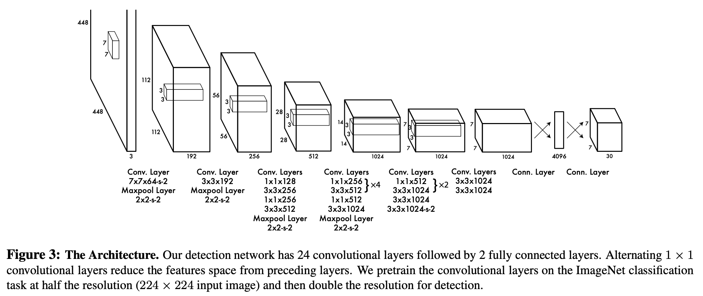

#### 2.2. Training
- convolutional layer를 ImageNet의 1000개 분류를 가진 데이터셋로 사전 학습했고,   
  이 과정에서 20개의 convolutional layer와 average-pooling 및 fc layer를 사용했습니다.
- 한 주간의 학습으로 top-5 accuracy 88%를 달성했고, 모든 학습에서 Darknet 프레임워크를 사용했습니다.
- 이후 랜덤하게 초기화된 4개의 convolutional layer와 2개의 fc layer를 추가하고,   
  탐지 작업을 위해 이미지의 해상도를 ${224}\times{224}$에서 ${448}\times{448}$로 증가시켰습니다.
- leaky linear activation을 적용한 마지막 layer는 분류와 bounding box 예측을 동시에 수행하며,   
  bounding box의 $x,y,w,h$를 전체 이미지 크기에 대해 0과 1 사이로 정규화 시켰습니다.
- 최적화 편의성을 위해 sum-squared error를 사용했지만,   
  평균 precision을 최대화 하고자 했던 목적을 달성하지는 못했습니다.
- 아무 객체도 존재하지 않는 cell이 gradient에 미치는 영향을 없애기 위해   
  해당하는 cell의 confidence를 0으로 처리했습니다.
- YOLO는 각 cell마다 다수의 bounding box를 예측하지만,   
  학습 과정에서는 하나의 bounding box를 예측하는 것이 이상적이 되도록 최적화했습니다.
- 135 epochs 동안 batch size 64 및 learning rate scheduler 등을 적용해 학습했습니다.
- overfitting을 방지하기 위해 dropout과 data augmentation을 사용하였고,   
  dropout은 0.5, data augmentation은 이미지 크기의 20%에 대해 랜덤 샘플링을 적용했습니다.

#### 2.4. Limitations of YOLO
- YOLO는 bounding box를 예측하는데 특화적이지만, 최대 2개의 box와 하나의 분류만 예측할 수 있습니다.
- 또한 새의 군집에서와 같이 작은 객체에 대한 탐지가 어렵습니다.
- 새로운 비율의 이미지에 대해 일반화하기도 어려우며, 예측 과정에서 여러번 downsampling을 수행합니다.
- 마지막으로, loss function의 경우 작은 bounding box와 큰 bounding box를 동일하게 처리하여,   
  작은 box에서의 에러가 큰 box에서의 에러보다 더 큰 영향을 끼칩니다.

### 3. Comparison to Other Detection Systems
- **DPM 모델**은 feature를 추출하고 bounding box를 예측하는 파이프라인이 분리되어 있는데,   
  YOLO는 이를 하나의 CNN으로 합쳐 더욱 빠르고 정확한 결과를 도출합니다.
- **R-CNN**은 슬라이딩 윈도우 대신 잠재적인 boudning box로부터 CNN으로 feature를 추출하고,   
  SVM으로 box를 측정하며, 선형 모델로 bounding box를 평가하는 등 복잡한 파이프라인을 가지지만,   
  YOLO는 마찬가지로 이러한 과정을 합쳤고, Selective Search보다 적은 수의 boudning box를 제안합니다.
- **Deep MultiBox**는 R-CNN과 다르게 Selective Search 대신 CNN을 사용하지만,   
  YOLO와 다르게 보편적인 객체 인식을 수행하지는 못합니다.
- **MUltiGrasp**는 YOLO의 grid 접근 방식의 기반이 되는 시스템이지만,   
  단지 객체의 존재 여부만 감지할 수 있고, 영역의 크기나 위치 등은 예측할 수 없습니다.

### 4. Experiments

#### 4.1. Comparison to Other Real-Time Systems

- 실시간 감지 성능을 평가하기 위해 30Hz 또는 100Hz 환경에서의 DPM과 YOLO를 비교하였고,   
  Fast YOLO기준 52.7%로 기존 26.1% 대비 2배의 정확도 증가, YOLO의 경우 63.4%의 정확도를 보였습니다.
- VGG-16을 사용해서 학습을 시도하기도 했는데, YOLO보다 높은 정확도가 나타났지만 매우 느린 속도를 보였습니다.
- DPM에서 적은 수준의 mAP의 감소만 가지고 높은 속도를 이끌어낸 Fastest DPM의 경우에도   
  여전히 인공신경망 대비 낮은 정확도를 보였습니다.
- R-CNN을 개선한 R-CNN Minus R이나 Fast R-CNN 또한 실시간으로 사용하기엔 부족한 모습을 보였고,   
  가장 높은 FPS를 보인 모델 조차 YOLO 대비 3배 낮은 FPS로 비슷한 정확도를 보였습니다.

  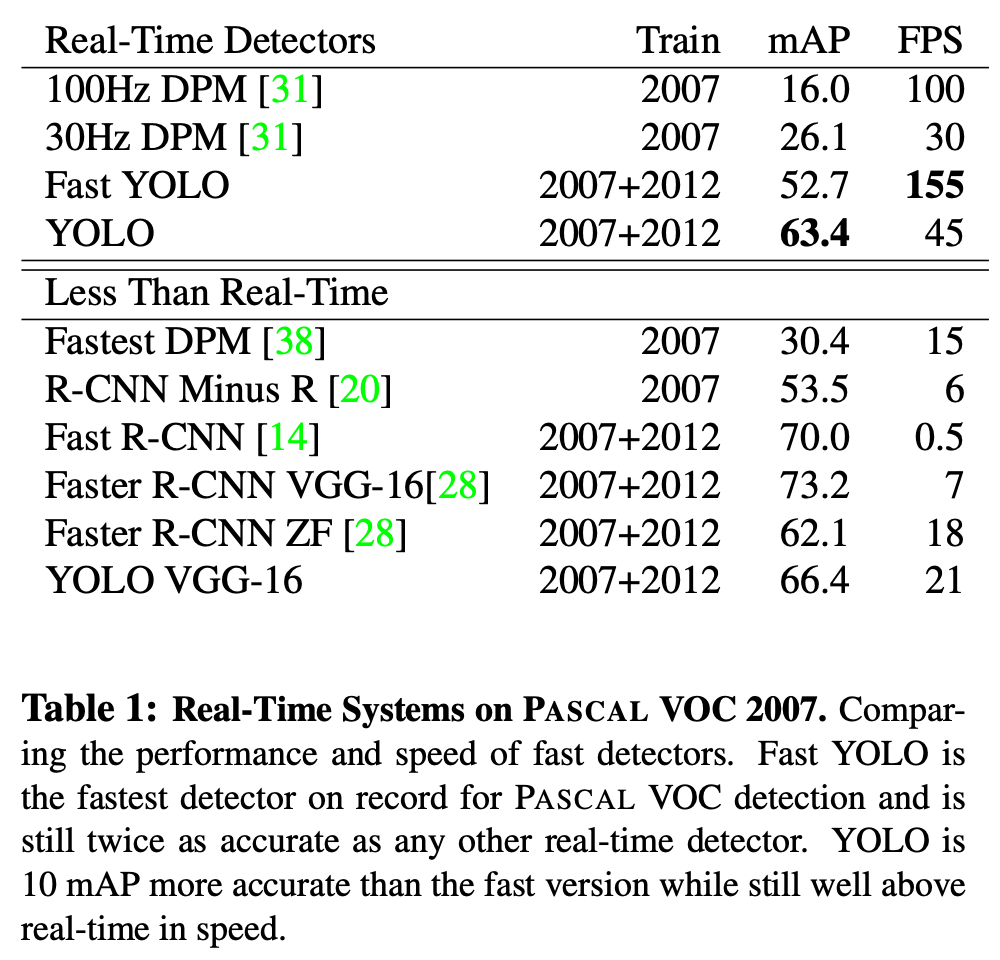

### 5. Real-Time Detection In The Wild
- YOLO의 빠르고 정확한 객체 인식기로서의 성능을 검증하기 위해 웹캠에 연결하여 실시간 성능을 확인했습니다.
- YOLO는 개별적으로 이미지를 처리하여 웹캠을 추적 시스템처럼 작동시키게 했습니다.

### 6. Conclusion
- 통합된 객체 인식 모델 YOLO는 구조적으로 만들기 쉽고 전체 이미지를 직접적으로 학습합니다.
- 분류기 기반 접근 방식과 다르게 YOLO는 인식 성능과 직접적으로 연관된 loss function을 사용하여 학습합니다.
- Fast YOLO는 일반적인 목적의 빠른 객체 탐지기로 실시간 객체 탐지에서 SOTA를 추구합니다.

---

## YOLOv4 Paper

> **YOLOv4: Optimal Speed and Accuracy of Object Detection**   
> 2020 · Alexey Bochkovskiy, Chien-Yao Wang, Hong-Yuan Mark Liao

<a href="https://arxiv.org/pdf/2004.10934.pdf"><button type="button" class="btn btn-primary">Paper Link</button></a>

### 1. Introduction
- CNN 기반 객체 탐지기의 대부분은 주차 공간 탐색 같은 추천 시스템에만 활용됩니다.
- 실시간 객체 인식 성능을 높인다면 단순히 추천 시스템에 도움을 주는 것이 아니라,   
  stand-alone으로 작업을 수행하면서 사람의 작업을 덜어줄 수 있습니다.
- 최신 인공신경망은 mini-batch와 많은 수의 GPU를 요구해 실시간으로 사용되지 않는데,   
  이러한 문제점을 개선해 전통적인 GPU 환경에서도 실시간으로 동작할 수 있는 모델을 제안합니다.
- 주요 목표는 생성 시스템에서 객체 인식의 처리 속도를 높이고 병렬로 최적화를 수행하는 것입니다.
- 전통적인 GPU 환경에서도 실시간으로 학습하고 테스트하며, 객체 인식 결과를 확신할 수 있기를 희망하며,   
  YOLOv4에 대한 결과는 아래 그림과 같습니다.

  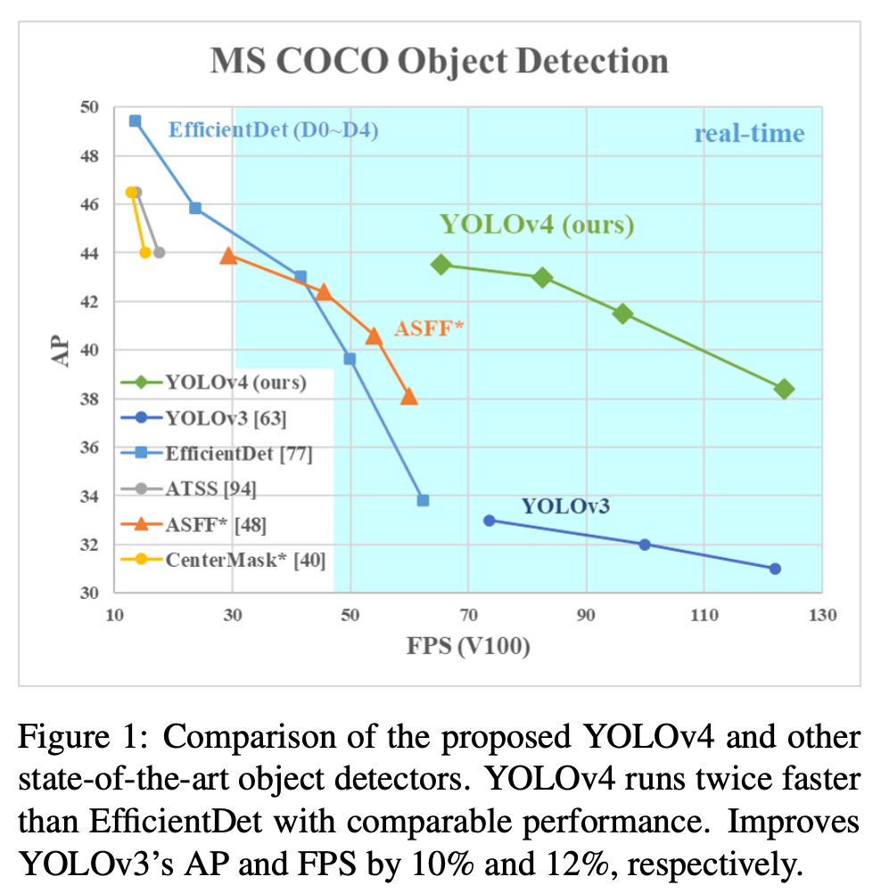

## 2. Related Works

### 2.1. Object Detection

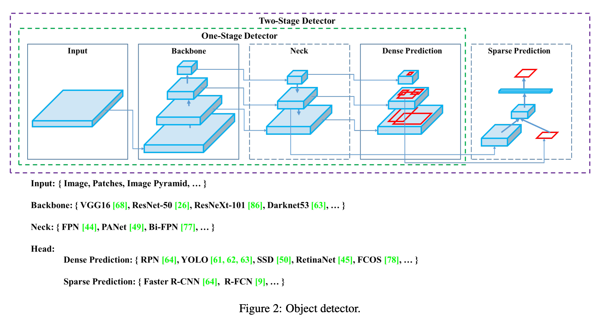

- **Backbone**: input을 feature map으로 변형하는 부분으로, pre-trained 모델을 주로 사용합니다.
- **Neck**: backbone과 head를 연결하는 부분으로, feature map에 대한 정제를 수행합니다.
- **Head**: feature map의 location 작업이 진행됩니다. (predicting classes, bounding box 등)
- **Dense Prediction**: prediction과 bounding box를 함께 수행합니다. (one-stage detector, YOLO 등)
- **Sparse Prediction**: prediction과 bounding boxes를 구분하여 수행합니다. (Two-Stage Detector)

### 2.2. Bag of Freebies (BoF)

- BoF는 inference cost 증가 없이 accuracy를 향상시키기 위한 기법입니다.
- **Data Augmentation**: input 이미지에 변화를 주어 환경 변화에 영향을 덜 받는 모델을 설계했습니다.
- **Normalization**: one-hot 표현식으로 상관관계를 표시하기 어렵기 때문에 label smoothing을 활용했습니다.
- **Object Function**: 전통적인 MSE 대신 ground truth를 기반으로 계산하는 IoU loss를 활용했습니다.

### 2.3. Bag of Specials (BoS)

- BoS는 inference cost를 조금만 증가시키면서 객체 감지에 대한 accuracy를 획기적으로 향상시킬 수 있는 기법입니다.
- **SPP**: SPM을 CNN과 결합시켜 bag-of-word 대신 max-pooling 과정을 거치게하는 기법입니다.
- **SPM**: 이미지 상에서 feature를 추출해 빈도수를 파악하는 기법입니다. (bag-of-word와 유사)
- **Attention Module**: SE, SAM 등이 있습니다.
- **Feature Integration**: SFAM, ASFF, BiFPN 등이 있습니다.
- **Activation Function**: LReLU, PReLU, Mish 등이 있습니다.
- **Post-Preprocessing**: NMS, DIoU NMS가 있습니다.

## 3. Methodology

### 3.1. Selection of architecture

- CSPDarknet53 (backbone), SPP (additional module), PANet (neck), YOLOv3 (head)

### 3.2. Selection of BoF and BoS

- Swish, Mish (activations), DIoU (bbox regression loss), CutMix (data augmentation),   
DropBlock (regularization method), CBN (normalization), CSP (skip-connections)

### 3.3. Additional improvements

- SAT (data augmentation), genetic algorithms (HPO),   
modified SAM, modified PAN, Cross mini-Batch Normalization (modified existing methods)

  <table align="center" style="border:hidden!important;">
  <tr>
    <td>
      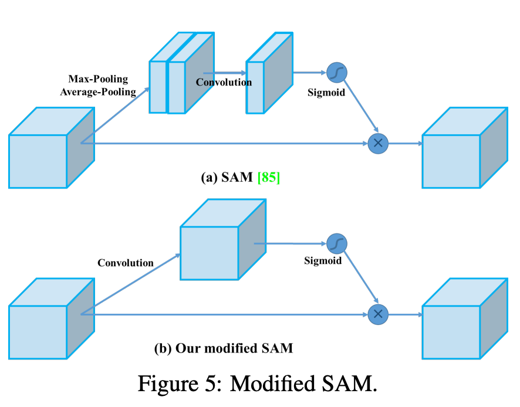
    </td>
    <td>
      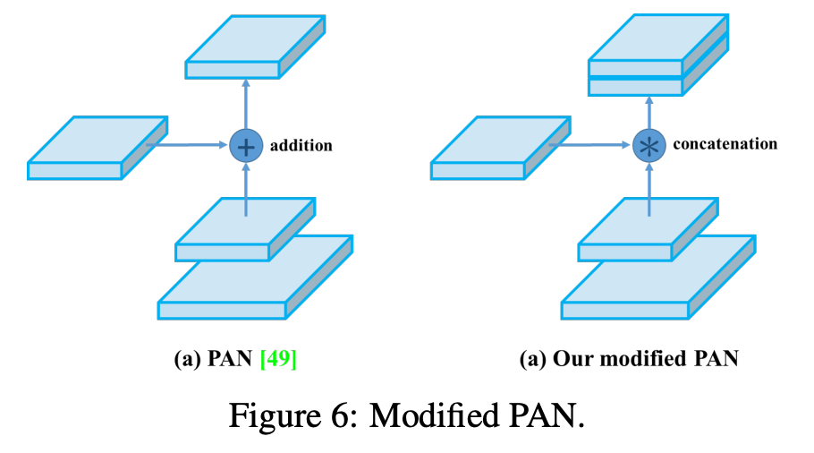
    </td>
  </tr>
  </table>

- **Mosaic**: 여러 이미지를 붙여서 한 장의 이미지로 사용해 적은 batch로 많은 이미지를 학습시키는 효과를 발생시킵니다.

  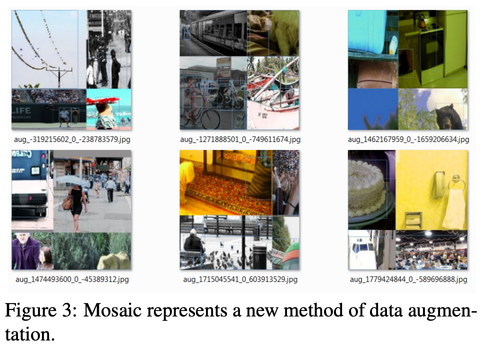

### 3.4. YOLOv4

- BoF와 BoS를 backbone과 detector에 대해 각각 나누어 설정했습니다.

## 4. Experiments

### 4.2. Influence of different features on Classifier training

- CSPResNeXt-50 backbone 기준에서,   
  CutMix, Mosaic, Label Smoothing, Mish 적용 시 가장 높은 성능이 발생했습니다.
- CSPDarknet-53 backbone에 동일한 기법을 적용했을 시 CSPResNeXt-50 보다 약간 떨어지는 성능을 보였습니다.

  <table align="center" style="border:hidden!important;">
  <tr>
    <td>
      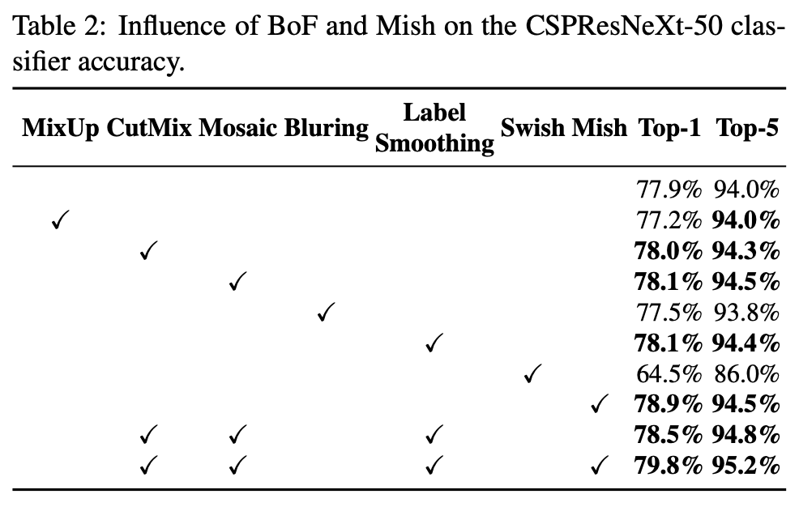
    </td>
    <td>
      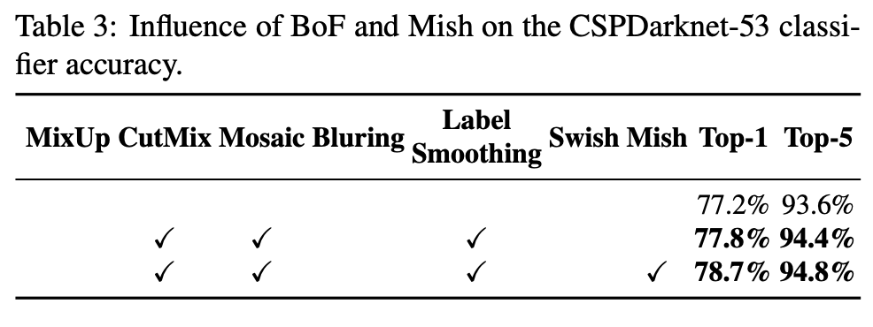
    </td>
  </tr>
  </table>

### 4.3. Influence of different features on Detector training

- Eliminate grid sensitivity, Mosaic, IoU threshold, Genetic algorithms, Optimized Anchors,   
  그리고 GIoU 또는 CIoU를 적용했을 시 가장 높은 성능을 보였습니다.

  <table align="center" style="border:hidden!important;">
  <tr>
    <td>
      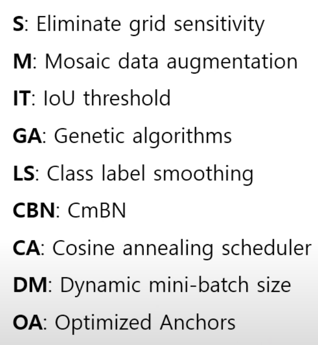
    </td>
    <td>
      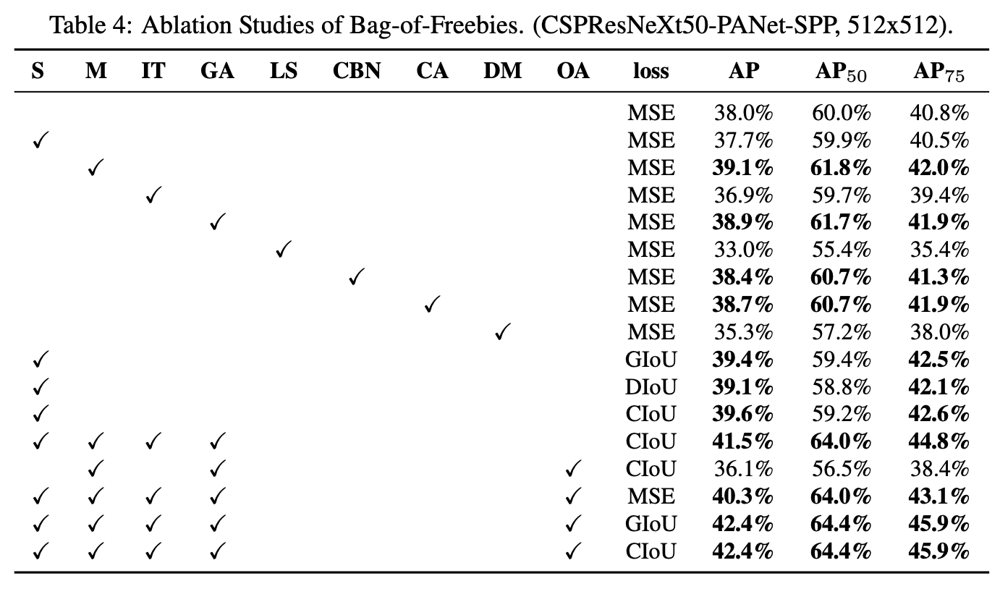
    </td>
  </tr>
  </table>

- SPP와 SAM 모듈을 적용했을 때 가장 높은 성능을 보였습니다.

  <table align="center" style="border:hidden!important;">
  <tr>
    <td>
      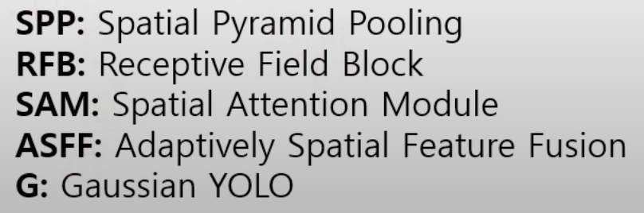
    </td>
    <td>
      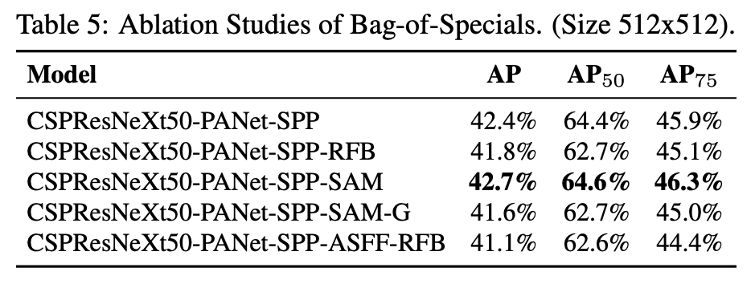
    </td>
  </tr>
  </table>

### 4.4. Influence of different backbones and pretrained weightings on Detector training

- CSPResNeXt-50 모델이 CSPDarknet-53 모델보다 classification 성능은 더 좋았지만,   
detection 성능은 CSPDarknet-53 모델이 더 우수한 것으로 확인되었습니다.

  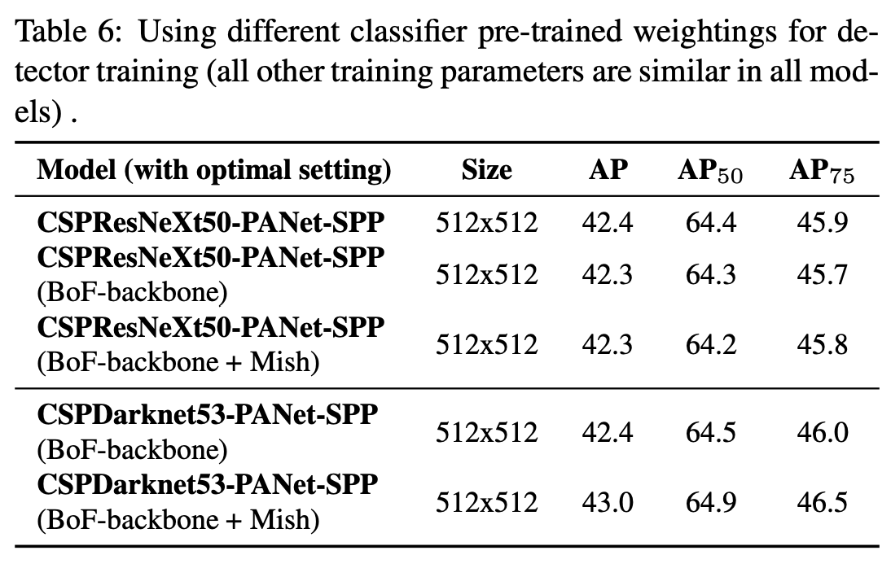

- CSPResNeXt-50 모델은 mini-batch를 8에서 4로 줄일 시 성능 하락이 보이지만,
CSPDarknet-53 모델에선 mini-batch를 줄여도 성능 차이가 나타나지 않았습니다.

  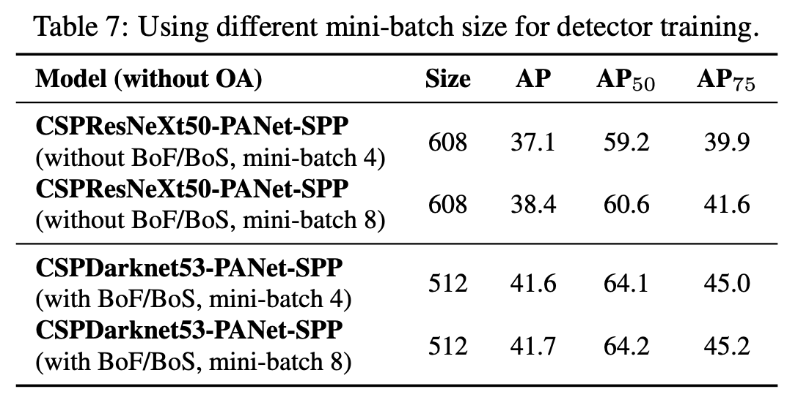

### 5. Results
- 다른 객체 인식 SOTA와 비교했을 때, YOLOv4는 매우 빠르고 정확한 탐지 성능을 보여주었습니다.
- 서로 다른 구조의 GPU 환경에서 추론 시간을 검증하기 위해 Maxwell, Pascal, Volta를 적용해 비교했습니다.

### 6. Conclusions
- 8-16GB VRAM의 전통적인 GPU 환경에서도 사용할 수 있으면서 빠르고 정확하기까지 한 SOTA 탐지기를 제시했습니다.
- anchor 기반의 객체 인식에 대한 효과를 증명했으며,   
  정확도를 높이기 위해 적용한 다양한 기법에 대한 연구 결과는 후속 연구에 있어 큰 도움이 될 것입니다.

---

## YOLOv7 Paper

> **YOLOv7: Trainable bag-of-freebies sets new state-of-the-art for real-time object detectors**   
> 2022 · Chien-Yao Wang, Alexey Bochkovskiy, Hong-Yuan Mark Liao

<a href="https://arxiv.org/pdf/2207.02696v1.pdf"><button type="button" class="btn btn-primary">Paper Link</button></a>

### 1. Introduction
- 실시간 객체 인식은 컴퓨터 비전 분야에서 잘 알려진 주제이며,   
  이러한 작업은 모바일 기기의 CPU, GPU, 또는 NPU 등에서 수행됩니다.
- 위와 같은 edge device에서는 다양한 연산 방식의 속도를 높이는데 주목하는데,   
  해당 논문에서는 모바일 GPU 및 클라우드 내 edge GPU device에서 사용가능한 객체 탐지기를 제안합니다.
- 최근의 연구에서는 edge CPU에서의 속도를 높이기 위한 목적의 MCUNet과 NanoDet,   
  다양한 GPU에서 속도를 높이기 위한 YOLOX와 YOLOR 등이 존재하며,   
  CPU 환경 모델의 기반으로는 MobileNet, ShuffleNet, GhostNet 등이 사용되고,   
  GPU 환경 모델의 기반으로는 ResNet, DarkNet, DLA, CSPNet 등이 사용됩니다.
- 하지만, 해당 논문에서는 추론 시간의 증가 없이 객체 인식의 정확도를 높일 수 있는 최적화 방식에 집중하여,   
  trainable bag-of-freebies라는 최적화 모듈을 제시합니다.
- 네트워크 학습에서 re-parameterization과 dynamic label assignemnt의 중요성이 강조되고 있는데,   
  이 역시 다뤄지면서 동시에, 해당 방식을 사용함에 있어 발생한 문제에 대해 논의해 볼 것입니다.
- re-parameterization의 경우 역전파 개념을 가지고 서로 다른 네트워크에서 적용시키기 위한 전략에 대해 분석하며,   
  dynamic label assignment는 어떻게 dynamic target을 여러 브랜치에 할당할지에 대해 다뤄봅니다.

### 2. Related work

#### 2.1. Real-time object detectors
- 객체 인식에서 SOTA는 주로 YOLO를 기반으로 하며, (1)빠른 네트워크 구조, (2)효과적인 feature integration,   
  (3)정확한 탐지 기법, (4)robust loss function, (5)효과적인 label 할당 및 (6)학습 기법의 특징을 가집니다.
- 해당 논문에서는 self-supervies 학습이나 knowledge distillation 보다는,   
  위 (4),(5),(6)과 연관된 trainable bag-of-freebies를 다룹니다.

#### 2.2. Model re-parameterization
- model re-parameterization은 여러 계산 모듈을 하나의 추론 단계로 합치는 것으로,   
  ensemble 중 module-level ensemble 및 model-level ensemble로 분류할 수 있습니다.
- model-level ensemble에는 여러 모델과 여러 학습 데이터를 학습한 결과 weight를 평균내는 것과,   
  서로 다른 반복 횟수 별 모델 가중치의 평균으로 동작하는 것입니다.
- module-level ensemble은 인기있는 연구 주제로 하나의 모듈을 여러 브랜치 모듈로 나눠 학습하고,   
  추론 과정에서 브랜치 모듈을 하나로 통합하는 것입니다.

#### 2.3. Model scaling
- model scaling은 컴퓨팅 환경에 맞춰 이미 설계된 모델을 늘리거나 축소시키는 것입니다.
- 입력 이미지 크기, 레이어 수, 채널 수, feature pyramid 수 등의 요소를 사용하여,   
  파라미터, 연산 능력, 추론 시간, 정확도 간에 최적의 trade-off를 수행합니다.
- Network Architecture Search(NAS)가 대표적인 model scaling 기법으로,   
  자동으로 환경에 맞춘 scaling 요소를 찾아낼 수 있지만, 높은 연산 비용이 발생하는 단점이 있습니다.
- DenseNet, VoVNet 같이 합쳐진 모델은 scale을 조정할 때 일부 레이어의 입력 너비가 변경하는데,   
  제안된 아키텍처가 concatenation-based model이기 때문에 새로운 복합 scaling 기법을 설계해야 합니다.

### 3. Architecture

#### 3.1. Extended efficient layer aggragation networks
- 효과적인 아키텍처를 설계하는데 있어 주요 고려사항은 파라미터 수, 연산량, 연산 집적도 입니다.
- Ma *et al.*는 메모리 접근 속도로부터 입력/출력 채널 비율, 아키텍처 브랜치 수,   
  요소 별 연산에 따른 네트워크 추론 속도 변화를 분석했습니다.
- Doller *et al.*는 model scaling 수행 시 활성화 함수를 추가로 고려했습니다.
- CSPVoVNet은 VoVNet의 변형으로 서로 다른 가중치의 layer가 다양한 feature를 학습할 수 있도록   
  gradient를 분석하며, 이것은 추론이 더 빠르고 정확해지는 것을 설명합니다.
- 효율적인 네트워크를 설계하는 전략에 대한 고민 끝에 가장 짧거나 긴 gradient path를 제어하여,   
  더 깊은 네트워크가 효과적으로 학습하고 수렴되게 할 수 있게 되었습니다.
- ELAN에서 위와 같은 과정을 기반으로한 Extended-ELAN(E-ELAN) 또한 해당 논문에서 제시됩니다.
- E-ELAN은 transition 계층의 변화 없이 단지 연산 블록의 구조만 변경시키지만,   
  연산 계층의 모든 블록에 same group parameter와 channel multiplier를 적용시켜 볼 것입니다.

#### 3.2. Model scaling for concatenation-based models
- model scaling의 주 목적은 모델의 일부를 수정해 서로 다른 요구 속도에 맞게 scale을 조정하는 것입니다.
- PlainNet 또는 ResNet과 같은 구조에서 scaling up 또는 scaling down이 실행되어도,   
  입력 차수와 출력 차수가 변하지 않지만, concatenation-based 구조에서는 Figure 3과 같은 변화가 발생합니다.
- 때문에, concatenation-based 모델에서 각각의 scaling 요소를 개별적으로 분석할 수 없기에,   
  depth의 변화에 따라 output channel을 고려하는 것과 같은 복합적인 model scaling을 제안해야 합니다.
- 제안될 복합 scaling 기법은 초기 설계 시의 특성을 유지하면서 최적의 구조를 유지할 수 있게 합니다.

  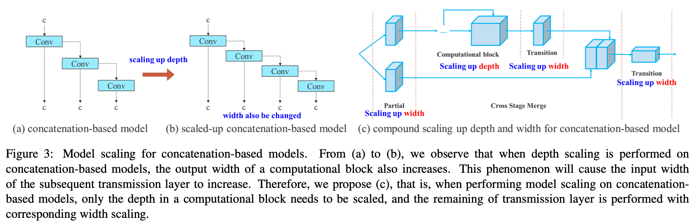

### 4. Trainable bag-of-freebies

#### 4.1. Planned re-parameterized convolution
- RepConv가 VGG에서 뛰어난 성능을 달성했지만, ResNet 및 DenseNet에 적용했을 시,   
  정확도가 크게 감소했습니다.
- re-parameterized convolution이 어떻게 다른 네트워크와 연결되는지 분석하기 위해,   
  planned re-parameterized 모델을 설계했습니다.
- RepConv와 다른 아키텍처와의 조합을 분석했을 때,   
  RepConv의 identity connection이 ResNet의 잔차와 DenseNet의 concatenation을 파괴하여   
  서로다른 feature 맵에 더 다양한 gradient를 제공한다는 것을 발견했습니다.
- 이러한 이유로 RepConv를 identity connection 없이 설계했을 때,   
  residual 및 concatenation 레이어가 re-parameterized convolution으로 대체됩니다.

#### 4.2. Coarse for auxiliary and fine for lead loss
- deep supervision은 DNN 학습에서 자주 사용되는 기술로,   
  네트워크의 중간에 auxiliary head를 추가하고, 보조적인 loss를 지표로하여 얕은 네트워크를 구성하는 것입니다.
- ResNet이나 DenseNet 같은 쉽게 수렴되는 아키텍처에서 deep supervision은,   
  많은 작업에서 효과적으로 모델의 성능을 향상시킬 수 있습니다.
- label assignment의 경우 과거엔 ground truch에 영향을 받아 규칙에 따라 hard label을 생성했지만,   
  최근엔 예측 결과의 품질과 분포를 ground truth와 함께 고려하여 soft label을 생성에 대한 최적화를 수행합니다.
- deep supervision은 auxiliary head나 lead head에 관계없이 대상을 학습해야 하는데,   
  soft label을 두 가지 head에 어떻게 할당할 것인지에 의문을 가지게 되었습니다.
- 이에 대한 해결책은 Figure 5에서 표현된 것과 같이, auxiliary head와 lead head를 분리하여,   
  각각의 예측 결과와 ground truth를 활용해 label assignment를 수행하는 것입니다.
- **lead head guided label assginer**는 주로 lead head의 예측 결과에 기반해 soft label을 생성하며,   
  이러한 soft label은 auxiliary head 및 label head의 target training model로 사용됩니다.
- **coarse-to-fine lead head guided label assigner**는 위와 동일하게 soft label을 생성하지만,   
  그 과정에서 coarse label과 fine label이라는 두 가지의 soft label을 생성합니다.
- find label은 기본적인 soft label이고, coarse label은 grid를 positive target으로 다루도록 생성됩니다.

### 5. Experiments

#### 5.1. Experimental setup
- Microsoft COCO 데이터셋을 사용하여 객체 인식 실헙과 검증을 수행합니다.
- 모든 모델은 pre-trained가 아닌 새로운 모델이며, 2017 데이터셋으로 SOTA 결과를 비교합니다.

#### 5.2. Baselines

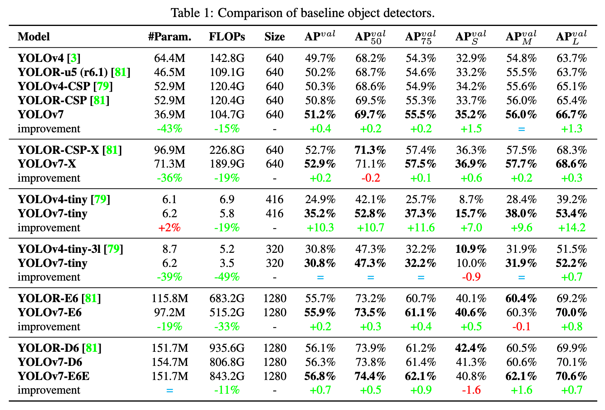

- Table 1과 같이 이전 버전의 YOLO와 YOLOR을 baseline으로 선택하여 YOLOv7과 비교했습니다.
- YOLOv4 대비 YOLOv7의 파라미터 수는 75%, 연산량은 36% 낮은 반면, AP는 1.5% 높게 나왔습니다.
- YOLOR-CSP에 비교해도 파라미터 수가 43%, 연산량이 36% 적으면서, 0.4%의 AP 증가가 있었습니다.
- tiny 모델과 클라우드 GPU 모델 역시 상대적으로 경량화된 구조에 같거나 높은 AP를 나타냈습니다.

#### 5.3. Comparison with state-of-the-arts

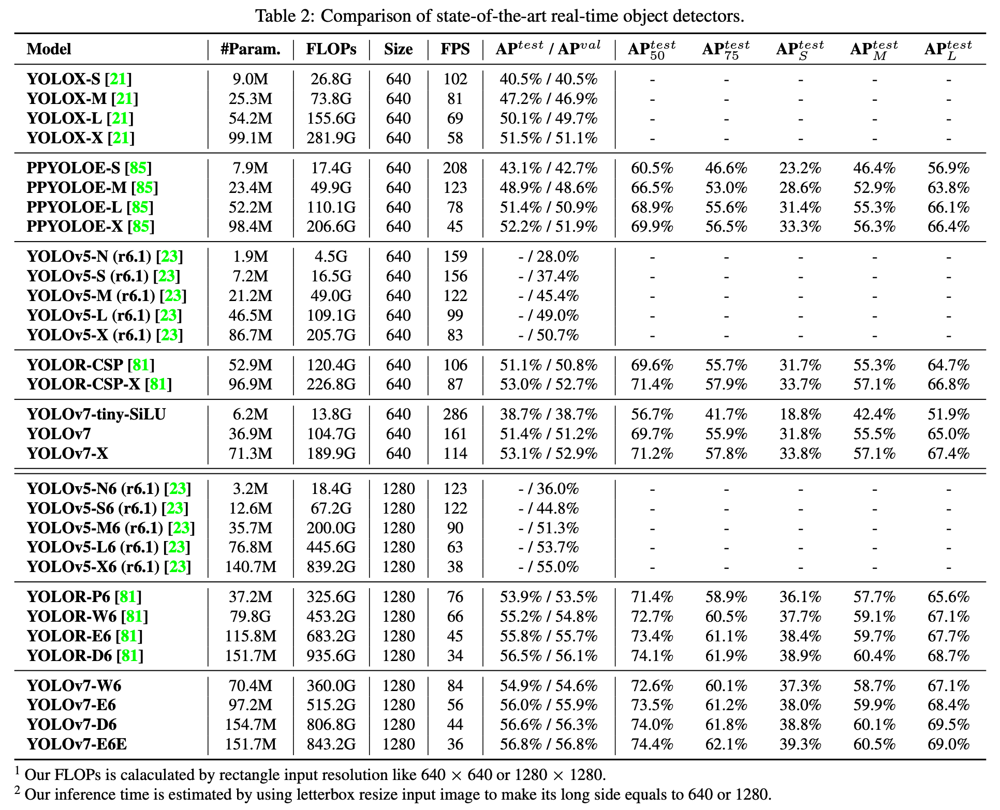

- Table 2와 같이 일반적인 GPU와 모바일 GPU에 대한 객체 인식 SOTA 모델을 비교했습니다.
- speed와 accuracy는 trade-off 관계에 있는 것을 인지하고 비교를 진행했고,   
  YOLOv7-tiny-SiLU와 YOLOv5-N6을 비교했을 때 127 FPS 더 빠르고 10.7% 더 정확했습니다.
- YOLOv7-X의 경우 YOLOv5-X6와 비슷한 크기면서 31 FPS 더 빠른 속도를 보였습니다.
- YOLOv7-D6의 속도는 YOLOR-E6와 비슷했지만, AP가 0.8% 증가했습니다.

#### 5.4. Ablation study
- 서로 다른 크기의 모델에 대해 scaling up한 결과를 비교했고,   
  compound scaling 기법을 width만 증가시키는 다른 기법과 비교했을 때,   
  적은 파라미터 수와 연산량에 비해 0.5%의 AP 상승이 확인되었습니다.
- planned re-parameterized 모델을 검증하기 위해,   
  concatenation-based 모델으로 3-stacked ELAN, residual-based model으로 CSPDarknet을 사용했고,   
  planned re-parameterized 모델이 전반적으로 높은 AP를 보여줌을 확인했습니다.
- lead head와 auxiliary head에 대한 label assignment를 비교했을 때,   
  base 대비 전반적인 성능 향상이 있었으며, coarse label을 적용한 경우가 최고의 성능을 보였습니다.

### 6. Conclusions
- 새로운 실시간 객체 인식 아키텍처와 model scaling 기법을 제안했습니다.
- 연구 과정에서 re-parameterized module 및 dynamic label assignment에 대한 문제점을 발견했고,   
  객체 인식 정확도를 높이는 trainable bag-of-freebies 기법을 제안해 문제를 해결하려 했습니다.
- YOLOv7는 SOTA를 달성했습니다.

---

## History of YOLO

> YOLOv1 to YOLOv6

### Basic Working of YOLO
- YOLO는 객체 인식에 대한 mAP(mean average precision)을 최대화하기 위한 목적으로 학습하며,   
  전반적인 구조는 3개의 요소 Backbone, Neck, Head로 구성되어 있습니다.
- Backbone은 시각적인 feature를 추출하는 CNN으로 ResNet, VGG, EfficientNet 등이 사용됩니다.
- Neck은 예측 단계 전에 특징들을 blending하기 위한 목적의 계츠응로 FPN, PAN, Bi-FPN 등이 있습니다.
- Head는 neck에서 처리된 feature를 가지고 회귀를 통해 bounding box 예측과 분류를 수행합니다.

### YOLOv1
- 최초의 YOLO는 2015년 Joseph Redmon으로부터 제안된 [논문](https://arxiv.org/pdf/1506.02640.pdf)으로부터 시작되었습니다.
- R-CNN의 느린 속도를 개선하기 위해 단순한 구조의 YOLO을 생성하였고 실제로 45 FPS에 대해 63.4 mAP를 보였습니다.
- YOLO는 이미지를 무수한 grid로 나누고 각 grid에서 객체가 존재할 확률을 계산했습니다.

### YOLOv2
- YOLOv2는 2016년 Joseph Redmon과 Ali Farhadi의 두번째 [논문](https://arxiv.org/pdf/1612.08242.pdf)에서 제안되었습니다.
- 이떄 명명된 YOLO9000은 9000개의 분류를 탐지할 수 있다는 의미로 이전보다 더욱 나은 성능을 보였습니다.
- YOLOv2의 경우 VOC 2012 데이터셋에 대해 78.6 mAP를 보였고, 이는 다른 객체 인식 모델과 비교해 월등한 성능입니다.
- YOLOv2는 anchor box라는 개념을 제시했는데 이는 미리 정해진 크기와 비율을 가진 bounding box로,   
  예측된 bounding box와 anchor box의 IoU를 비교하여 계산하여 IoU가 theshold처럼 사용되게 합니다.
- anchor box의 개수와 형태는 K-means clustering을 활용해 데이터셋에 따라 적절하게 결정됩니다.
- 다양한 비율에 적용하기 위해 학습 과정에서 랜덤으로 이미지에 대해 resizing을 수행합니다.
- robust 방식을 적용해 bounding box가 존재하는 COCO 데이터셋과 bounding box가 없는 ImageNet 데이터셋을 사용하여,   
  라벨이 없는 이미지에 대해선 분류 에러만 처리하도록 했습니다.
- 추론 속도는 200 FPS에 대해 75.3 mAP를 달성했고, darknet19 아키텍처가 사용되었습니다.

### YOLOv3
- YOLOv3는 2018년 Joseph Redmon과 Ali Farhadi의 세번째 [논문](https://arxiv.org/pdf/1804.02767.pdf)에서 제안되었습니다.
- YOLOv3-320은 22 mili초 동안 28.2 mAP를 보였고, 이는 SSD 객체 탐지 기술보다 3배 빠른 속도입니다.
- YOLOv3는 fc 또는 pooling layer없이 75개의 convolutional layer로 구성되어 모델 사이즈가 크게 감소했습니다.
- FPN이 feature extractor로 사용되어 단일 이미지에서 types, forms, sizes 등의 특징을 잡아내 합칩니다.
- logistic classifier와 activation을 적용해 RetinaNet-50보다 높은 accuracy를 달성했습니다.
- backbone에서 YOLOv3는 Darknet53 아키텍처를 사용합니다.

### YOLOv4
- YOLOv4부터는 Joseph Redmon이 더이상 참여하지 않게 되었는데,   
  대신 2020년 Alexey Bochkovskly에 의한 새로운 [논문](https://arxiv.org/pdf/2004.10934.pdf)을 통해 제안되었습니다.
- YOLOv4는 efficientDet과 ResNext50과 같은 탐지 모델보다 높은 성능을 보였고,   
  YOLOv3와 같은 Darknet53을 backbone으로 사용했습니다.
- YOLOv4는 시간의 증가 없이 accuracy를 상승시키는 bag of freebies와,   
  약간의 시간 증가를 통해 accuracy를 크게 향상시키는 bag of specials를 적용했습니다.
- 이를 통해 62 FPS에 대해 43.5 mAP를 보였습니다.
- Bag of Freebies(BOF)로는 CutMix 같은 데이터 증강 기법, IoU 등의 bounding box regression loss,   
  dropout 등의 규제, mini-batch 등의 정규화가 사용되었습니다.
- Bag of Specials(BOS)로는 feature map을 생성하는 SAM, 객체를 그룹화하여 동시에 여러 개의 bounding box를 얻는 NMS,   
  ReLU와 같은 non-linear activation functions, WRC 또는 CSP와 같은 Skip-Connections가 사용되었습니다.

### YOLOv5
- YOLOv5는 YOLOv4 소개 후 얼마 지나지 않은 2020년 Ultranytics라는 기업으로부터 발표되었지만,   
  아직까지 논문이 제시되지 않았고 YOLOv3를 PyTorch로 구현한 것에 불과하다는 평가를 받습니다.
- 공식 논문이 존재하지 않아 성능을 보장받지는 못했으며,   
  상대적으로 적은 계산 비용에 대해 다른 YOLO 모델과 비슷한 55.6 mAP를 달성했습니다.

### YOLOv6
- YOLOv6도 마찬가지로 모델 구조의 변화만 가지고 2021년에 업데이트되었습니다.
- 이전 버전과의 차이점은 모델이 더 깊어졌고, head가 기존 3개에서 4개 scale로 변경되었다는 점입니다.
- 학습 시 Mosaic, Mixup, Copy & Paste를 수행합니다.
- loss 역시 동일하게 boundary box에 대한 loss로 CIoU loss를 사용하고,   
  classification과 confidence에 대한 loss로 binary cross entropy 및 focal loss를 사용합니다.
- nano 버전이 생겨났으며, YOLOv4의 tiny 모델에 비해 training 및 inference 속도 모두 향상되었습니다.

### Summary
- YOLOv2부터 anchor box가 도입되었으며, K-means clustering으로 optimal한 크기와 개수를 정해줍니다.
- 또한, YOLOv2부터 fc layer가 사라져, 다양한 크기의 input을 넣을 수 있게 되었습니다.
- YOLOv3에서는 3개 scale로 예측하면서 small object를 잘 못찾는 문제를 개선했습니다.
- YOLOv4에서는 Mosaic, MixUp 등 다양한 증강 기법을 적용하여 성능을 향상시켰습니다.
- 또한, YOLOv4에서는 CSP layer를 활용하여 정확도는 향상시키되, 속도를 감소시켰습니다.
- YOLOv4까지는 Darknet 기반의 backbone을 사용했지만, YOLOv5부터 PyTorch로 구성된 backbone을 사용합니다.
- YOLOv6부터는 3개 scale 탐지를 4개로 늘려 더욱 다양한 크기의 객체를 탐지할 수 있게 되었습니다.
- 추가적으로 PP-YOLO, Scaled-YOLOv4, YOLOR, YOLOX 등의 모델이 있습니다.

### References
- [A Brief History of YOLO Object Detection Models From YOLOv1 to YOLOv5](https://machinelearningknowledge.ai/a-brief-history-of-yolo-object-detection-models/)
- [Object Detection이란? Object Detection 용어정리](https://leedakyeong.tistory.com/entry/Object-Detection이란-Object-Detection-용어정리)
- [[Object Detection(객체 검출)] YOLO v1 : You Only Look Once](https://leedakyeong.tistory.com/entry/Object-Detection객체-검출-딥러닝-알고리즘-history-및-원리)
- [YOLO v1 ~ v6 비교(1)](https://leedakyeong.tistory.com/entry/Object-Detection-YOLO-v1v6-비교)
- [YOLO v1 ~ v6 비교(2)](https://leedakyeong.tistory.com/entry/Object-Detection-YOLO-v1v6-비교2)

---

## CNN Models

 

### Summary

<table>
  <tr><th width="33%" align="center">CNN</th><th width="33%" align="center">LeNet</th><th width="33%" align="center">AlexNet</th></tr>
  <tr>
    <td align="center">filter를 이용해 feature map 생성</td>
    <td align="center">MNIST 데이터셋을 이용해 학습</td>
    <td align="center">2개의 GPU로 병렬 처리</td>
  </tr>
  <tr><th align="center">VGGNet</th><th align="center">Network in Network</th><th align="center">GooLeNet</th></tr>
  <tr>
    <td align="center">작은 filter를 여러 번 사용</td>
    <td align="center">Convolutional Layer에 MLP 적용</td>
    <td align="center">서로 다른 크기의 filter를 동시에 사용</td>
  </tr>
  <tr><th align="center">InceptionV2</th><th align="center">InceptionV3</th><th align="center">InceptionV4</th> </tr>
  <tr>
    <td align="center">GooLeNet에서 filter를 나누어 사용</td>
    <td align="center">가장 최적화된 Inception</td>
    <td align="center">단순하고 획일화된 구조 및 Skip Connection 적용</td>
  </tr>
  <tr><th align="center">ResNet</th><th align="center">MobileNet</th><th align="center">DenseNet</th></tr>
  <tr>
    <td align="center">Skip Connection</td>
    <td align="center">작은 사이즈에 최적화</td>
    <td align="center">전체 네트워크에 Skip Connection 적용</td>
  </tr>
  <tr><th align="center">SeNet</th><th align="center">ShuffleNet</th><th align="center">NasNet</th></tr>
  <tr>
    <td align="center">feature를 압축하고 다시 복원</td>
    <td align="center">pointwise 연산 시 channel 간 shuffle</td>
    <td align="center">cell 단위로 네트워크 조합 탐색</td>
  </tr>
  <tr><th align="center">EfficientNet</th><th align="center"></th><th align="center"></th></tr>
  <tr>
    <td align="center">작은 모델을 탐색하고 최적화</td>
    <td align="center"></td>
    <td align="center"></td>
  </tr>
</table>

### [CNN](http://yann.lecun.com/exdb/publis/pdf/lecun-89e.pdf)
- 일정한 크기의 필터를 이용해 이미지를 스캔하면서 각 데이터와 필터의 값을 곱해서 더합니다.
- 출력 데이터의 크기를 일정하게 만들기 위해 주변에 padding을 추가합니다.
- 데이터의 특징을 더 잘 추출하기 위해 텐서의 크기를 줄이는 pooling을 수행합니다.

### [LeNet](http://yann.lecun.com/exdb/publis/pdf/lecun-01a.pdf)
- MNIST 데이터셋을 이용해 학습하였고, 기존의 알고리즘보다 높은 성능을 보였습니다.

### [AlexNet](https://proceedings.neurips.cc/paper/2012/file/c399862d3b9d6b76c8436e924a68c45b-Paper.pdf)
- 얼굴, 사물인식처럼 더 복잡한 데이터를 다루기에는 부족한 컴퓨터 연산 능력을 보완하기 위해,   
  2개의 GPU를 사용해 연산 시 병렬 처리가 가능하게 한 모델입니다.
- ReLU activation function을 사용했고, 파라미터가 커짐에 따라 발생할 과적합 문제를 해결하기 위해 dropout을 적용했습니다.
- **Local Response Normalization**을 통해 인접한 채널에서 같은 위치에 있는 픽셀 n개를 정규화하여,   
  큰 input을 그대로 전달해 주변 값들이 무시되는 ReLU의 문제를 개선했습니다.
- **Data augmentation**을 적용시켜 데이터를 수평 반전 및 랜덤으로 잘라서 다양한 데이터를 생성했습니다.

### [VGGNet](https://arxiv.org/pdf/1409.1556.pdf)
- AlexNet이 5개의 conv layer를 사용한 것에 비해 VGG-16은 13개의 conv layer와 3개의 fc layer를 사용한 모델입니다.
- 3x3 필터로 여러 번 convolution 하는 것과 7x7 필터로 convolution 하는 것이 동일한 결과를 낸다고 밝혔지만,   
  여러 번 ReLU 함수를 사용하여 비선형성을 증가시키고, 학습 파라미터 수를 감소시킨다는 면에서 3x3 필터를 사용했습니다.

### Network in Network
- 기존 CNN 같은 linear conv layer 구조로는 필터가 늘어남에 따라 증가하는 연산량을 해결할 수 없어 MLP를 적용한 모델입니다.
- channel이 여러 개로 쌓인 구조에서 차원을 줄여주기 위해 1x1 conv layer를 사용합니다.

### [GooLeNet](https://arxiv.org/pdf/1409.4842.pdf)
- AlexNet보다 파라미터 수가 12개 적지만 정확도는 훨씬 높은 모델로,   
  conv filter size에 따른 위치 정보와 local region 간 trad-off 관계를 고려하여 순서 없이 한번에 사용했습니다.
- Inception module은 1x1, 3x3, 5x5 conv 및 3x3 max pooling을 동시에 수행하고 output을 merge하는데,   
  channel이 많아질수록 연산이 복잡해지는 문제를 해결하기 위해 1x1 conv로 차원을 우선 축소하고 연산을 수행합니다.
- GooLeNet은 Inception module을 여러 층 쌓은 구조이며 중간마다 auxiliary classifier network를 사용해,   
  역전파 과정에서 gradient를 증폭시켜 네트워크가 깊어짐에 따른 gradient vanishing 문제를 해결했습니다.

### [InceptionV2](https://arxiv.org/pdf/1502.03167v3.pdf)
- 기존 GooLeNet에서 연산량을 더 줄여보기 위해 기존 filter를 나누어 사용한 모델입니다.
- 5x5 conv layer를 2개의 3x3 conv layer로 대체해 파라미터 수를 25에서 18로 줄였고,   
  7x7 conv layer 역시 3개의 3x3 conv layer로 대체해 파라미터 수를 49개에서 27개로 줄였습니다.
- nxn conv layer 또한 1xn과 nx1 conv layer로 나누었고,   
  기존 GooLeNet에서 auxiliary classifier 2개 중 하나를 제거한 구조를 가집니다.

### [InceptionV3](https://arxiv.org/pdf/1512.00567.pdf)
- InceptionV2의 구조적 변화 없이 파라미터를 수정하면서 더 좋게 나온 결과를 합친 모델입니다.
- Optimzer를 RMSProp으로 변경했고, Label Smoothing을 적용해 과적합을 방지했습니다.
- 마지막 fc layer에 batch normalization을 적용한 BN-auxiliary를 사용했습니다.

### [InceptionV4](https://arxiv.org/pdf/1602.07261.pdf)
- 성능은 좋지만 구조가 복잡한 기존 Inception 모델을 개선해,   
  단순하고 획일화된 구조와 더 많은 Inception module을 사용했습니다.
- Stem > Inception-A > Reduction-A > Inception-B > Reduction-B >   
  Inception-C > Average Pooling > Dropout > Softmax로 구성되어 있습니다.
- 기존의 Inception module에 ResNet의 residual connection을 결합해 더 빠른 학습을 가능하게 했습니다.

### [ResNet](https://arxiv.org/pdf/1512.03385.pdf)
- Microsoft에서 개발한 모델로, VGG-16과 같이 convolution과 pooling의 반복을 통해,   
  특징을 추출하고 마지막에 fc layer를 통해 분류합니다.
- 이전 layer와 다음 layer를 연결하는 residual connection (skip connection)이 존재하는데,   
  동일한 연산을 하고 input을 다시 더함으로써, 기존에 학습한 정보를 보존하고 추가적으로 정보를 학습합니다.
- residual block은 층이 깊어질수록 발생하는 gradient vanishing 문제를 해결하기 위해,   
  gradient가 잘 흐를 수 있도록 skip connection을 제공하는 것으로 LSTM의 철학과 유사합니다.
- skip connection을 통해 입력 데이터와 gradient가 오갈 수 있는 통로가 늘어 ensemble과 비슷한 효과를 발생시켰고,   
  이미 배웠던 내용이 제공되기 때문에 VGG-16 대비 훈련에 소요되는 시간이 훨씬 줄어들었습니다.

### [MobileNet](https://arxiv.org/pdf/1704.04861.pdf)
- Google에서 개발한 모델로, 작은 사이즈에 최적화되어 있어 모바일 기기 등에서 동작하기에 이상적입니다.
- 사이즈가 작은 만큼 VGG-16 또는 ResNet 대비 정확도가 떨어지지만,   
  일반적인 conv layer를 활용한 모델과 비교해 9배의 계산량과 7배의 파라미터를 줄이면서 비슷한 정확도를 보입니다.

### [DenseNet](https://arxiv.org/pdf/1608.06993.pdf)
- ResNet에서 발전해 전체 네트워크의 모든 층과 통하는 지름길을 생성한 모델입니다.
- feature map을 연결하는 연산으로 add 대신 concat을 사용하는데,   
  채널 자체를 굉장히 작은 수로 줄여 feature map이 커지는 문제를 방지했습니다.

### [SeNet](https://arxiv.org/pdf/1709.01507.pdf)
- Squeeze and Excitation이라는 이름처럼 filter와 global average pooling을 적용한 텐서에,   
  오토인코더 구조처럼 reduction ratio라는 값을 통해 압축시켰다가 다시 같은 사이즈로 펼쳐내는 방식으로 증폭시킵니다.
- 위와 같은 과정의 Se block을 Inception과 ResNet과 같은 기존 네트워크에 가져다 붙여 사용합니다.

### [ShuffleNet](https://arxiv.org/pdf/1707.01083.pdf)
- MobileNet처럼 적은 파라미터 수 대비 성능을 높이기 위한 목적의 모델입니다.
- 기존 seperable convolution에서 필터별 연산에 해당하는 pointwise 연산이   
  정보의 손실을 가져오는 문제를 개선하기 위해 channel 간 정보를 섞어 정보 교류를 발생시킵니다.

### [NasNet](https://arxiv.org/pdf/1707.07012.pdf)
- 기존 NAS는 RNN Controller와 Reinforcement Learning을 활용해   
  CIFAR-10 데이터셋에 대한 최적의 네트워크를 찾아냈는데, 여기서 발생하는 비효율을 개선하기 위해   
  convolution cell이라는 단위를 먼저 추정하고 이들을 조합해 전체 네트워크를 구성했습니다.
- NAS의 layer 별 탐색에 비해 cell 별 탐색을 통해 사람이 이해할 수 있는 형태를 띄었습니다.

### [EfficientNet](https://arxiv.org/pdf/1905.11946.pdf)
- MnasNet을 통해 얻어진 EfficientNet-B0이라는 작은 모델을 주어진 task에 최적화된 구조로 수정했습니다.
- compound scaling을 통해 depth, width, resolution에 대한 파라미터 및 조건을 정의하고,   
  grid search 기법으로 alpha, beta, gamma 값을 찾아 세 가지가 같은 비율로 조정될 수 있게 했습니다.
- 파라미터 수와 연산을 줄이면서도, 기존 모델과 비슷하거나 오히려 높은 정확도를 달성했습니다.

### References
- [Inception v1,v2,v3,v4는 무엇이 다른가 (+ CNN의 역사)](https://hyunsooworld.tistory.com/40)
- [이미지 인식: 1. 이미지 분류(Image Classification)의 정의와 주요 모델 비교](https://medium.com/ddiddu-log/이미지-인식의-정의와-주요-모델-비교-1-이미지-분류-image-classification-ae7a59bfaf65)
- [CNN 주요 모델들](https://ratsgo.github.io/deep%20learning/2017/10/09/CNNs/)
- [CNN의 흐름? 역사?](https://junklee.tistory.com/111)
