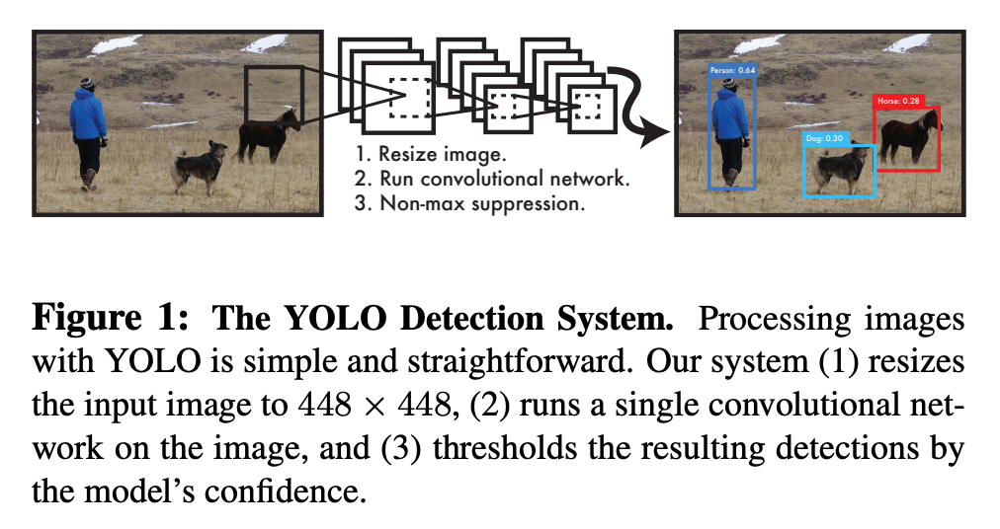
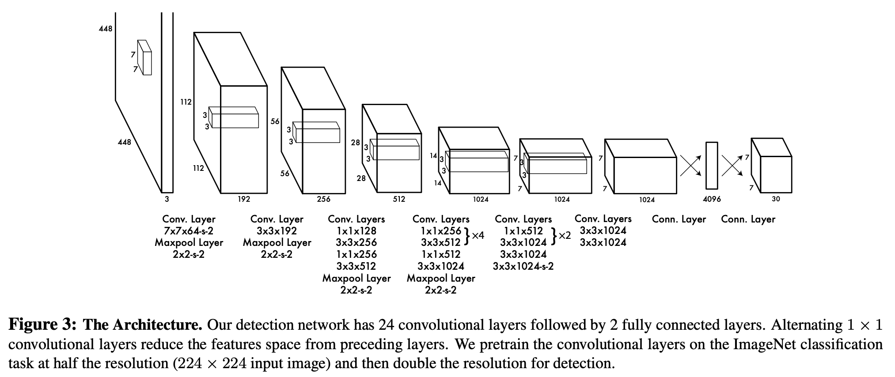
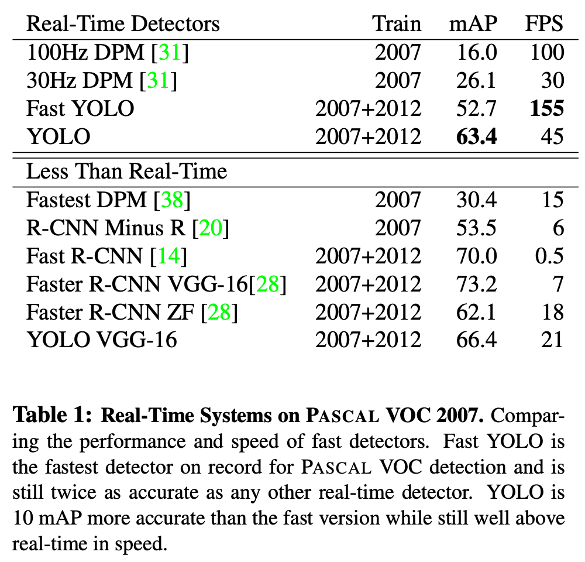

# YOLO Background

## Index
- [Introduction](#introduction)
- [YOLOv1 Paper](#yolov1-paper)
- [History of YOLO](#history-of-yolo)
- [YOLOv7 Paper](#yolov7-paper)

---

## Introduction
- 과거 [Dinut](https://github.com/minyeamer/dinut)이라는 식단 영양 분석 서비스를 제작한 적이 있었는데,   
  당시 객체 인식 모델로서 사용했던 YOLO에 대해 자세히 알아보고 싶은 취지를 가지고 해당 분석을 진행합니다.
- 초기 버전의 YOLO 모델에 대한 논문을 알아보고, YOLOv1부터 YOLOv6까지의 변화를 정리해봅니다.
- 프로젝트 진행 당시의 YOLO 최신 버전은 v5였지만, 해당 모델에 대한 논문이 현재까지 존재하지 않는 점과,   
  2022년 8월인 현시점의 기준에서 YOLOv7까지 개발된 상태이기 때문에 최신 버전인 YOLOv7의 논문을 살펴봅니다.
- 별도의 노트북 파일에서 YOLOv7에 대한 코드 분석을 수행합니다.
- 해당 문서는 필요에 의하여 지속적으로 업데이트 됩니다.

---

## YOLOv1 Paper

> **You Only Look Once: Unified, Real-Time Object Detection**   
> CVPR 2015 · Joseph Redmon, Santosh Divvala, Ross Girshick, Ali Farhadi

<a href="https://arxiv.org/pdf/1506.02640v5.pdf"><button type="button" class="btn btn-primary">Paper Link</button></a>

### 1. Introduction
- 사람은 이미지를 한 번 본 것만으로 어떤 물체인지 인식할 수 있을 정도로 빠르고 정확한데,   
  이러한 알고리즘을 컴퓨터에 적용할 수 있다면 자율주행, 로봇 등의 기술 발전에 도움이 될 것입니다.
- 현재의 객체 인식 시스템은 이미지 내 다양한 위치에서 분류 작업을 수행하며,   
  DPM과 같은 모델 슬라이딩 윈도우 방식을 사용해 전체 이미지 내 특정 부분을 분석합니다.
- 최신 기법인 R-CNN은 이미지 내 bounding box를 예측하도록 하지만,   
  더욱 정교한 bounding box를 찾기 위해 반복적으로 평가하는 방식은 매우 느리고 최적화가 어렵습니다.
- YOLO는 객체 인식을 단일 회귀 문제로 정의하여 한번에 bounding box 예측과 분류를 할 수 있고,   
  해당 방식은 아래 그림과 같이 단일 CNN 모델이 동시에 예측 및 분류 작업을 수행하는 것입니다.

  

- YOLO는 Titan X GPU 환경에서 150 fps의 영상을 처리할 수 있을 정도로 빠르고,   
  전체 이미지를 한번에 분석하기 때문에 맥락을 이해할 수 있다는 장점이 있습니다.

### 2. Unified Detection
- YOLO는 객체 인식에서 분리되었던 요소들을 하나의 인공신경망으로 합침으로써,   
  전체 이미지의 feature를 사용해 각각의 bounding box를 예측하고 분류합니다.
- 해당 시스템은 이미지를 $SxS$ 그리드로 구분하고 객체의 중심점이 특정 cell에 들어오면,   
  객체를 인식했다고 판단합니다.
- 각각의 cell은 $\text{Pr(Object)}*\text{IOU}^\text{truth}_\text{pred}$ 식으로 boudning box에 대한 confidence를 예측하며,   
  truth와 pred의 합집합에 대한 교점이 같아지기 위한 confidence score를 평가합니다.
- 각각의 bounding box는 $x,y,w,h$ 및 confidence로 구성되어 있으며,   
  $(x,y)$는 객체의 중심점, $(w,h)$는 객체의 길이와 높이입니다.
- 각각의 cell은 동시에 객체의 분류에 대한 확률 $\text{Pr(Class|Object)}$을 예측하며,   
  box의 개수에 관계없이 하나의 cell에 하나의 분류를 예측합니다.

#### 2.1. Network Design
- YOLO는 CNN으로 구현되었으며, PASCAL VOC 탐지 데이터셋으로 평가했습니다.
- 앞단의 convolutional layer가 이미지로부터 feature를 추출하고, fc layer가 확률을 예측합니다.
- 전체 네트워크는 24개의 convolutional layer와 2개의 fc layer로 구성되고,   
  구조 설계에서 영향을 받은 GooLeNet의 inception 모듈을 $1x1$ 사이즈로 축소시켰습니다.
- Fast YOLO의 경우 9개의 convolutional layer와 더 적은 수의 filter를 사용합니다.

  

#### 2.2. Training
- convolutional layer를 ImageNet의 1000개 분류를 가진 데이터셋로 사전 학습했고,   
  이 과정에서 20개의 convolutional layer와 average-pooling 및 fc layer를 사용했습니다.
- 한 주간의 학습으로 top-5 accuracy 88%를 달성했고, 모든 학습에서 Darknet 프레임워크를 사용했습니다.
- 이후 랜덤하게 초기화된 4개의 convolutional layer와 2개의 fc layer를 추가하고,   
  탐지 작업을 위해 이미지의 해상도를 ${224}\times{224}$에서 ${448}\times{448}$로 증가시켰습니다.
- leaky linear activation을 적용한 마지막 layer는 분류와 bounding box 예측을 동시에 수행하며,   
  bounding box의 $x,y,w,h$를 전체 이미지 크기에 대해 0과 1 사이로 정규화 시켰습니다.
- 최적화 편의성을 위해 sum-squared error를 사용했지만,   
  평균 precision을 최대화 하고자 했던 목적을 달성하지는 못했습니다.
- 아무 객체도 존재하지 않는 cell이 gradient에 미치는 영향을 없애기 위해   
  해당하는 cell의 confidence를 0으로 처리했습니다.
- YOLO는 각 cell마다 다수의 bounding box를 예측하지만,   
  학습 과정에서는 하나의 bounding box를 예측하는 것이 이상적이 되도록 최적화했습니다.
- 135 epochs 동안 batch size 64 및 learning rate scheduler 등을 적용해 학습했습니다.
- overfitting을 방지하기 위해 dropout과 data augmentation을 사용하였고,   
  dropout은 0.5, data augmentation은 이미지 크기의 20%에 대해 랜덤 샘플링을 적용했습니다.

#### 2.4. Limitations of YOLO
- YOLO는 bounding box를 예측하는데 특화적이지만, 최대 2개의 box와 하나의 분류만 예측할 수 있습니다.
- 또한 새의 군집에서와 같이 작은 객체에 대한 탐지가 어렵습니다.
- 새로운 비율의 이미지에 대해 일반화하기도 어려우며, 예측 과정에서 여러번 downsampling을 수행합니다.
- 마지막으로, loss function의 경우 작은 bounding box와 큰 bounding box를 동일하게 처리하여,   
  작은 box에서의 에러가 큰 box에서의 에러보다 더 큰 영향을 끼칩니다.

### 3. Comparison to Other Detection Systems
- **DPM 모델**은 feature를 추출하고 bounding box를 예측하는 파이프라인이 분리되어 있는데,   
  YOLO는 이를 하나의 CNN으로 합쳐 더욱 빠르고 정확한 결과를 도출합니다.
- **R-CNN**은 슬라이딩 윈도우 대신 잠재적인 boudning box로부터 CNN으로 feature를 추출하고,   
  SVM으로 box를 측정하며, 선형 모델로 bounding box를 평가하는 등 복잡한 파이프라인을 가지지만,   
  YOLO는 마찬가지로 이러한 과정을 합쳤고, Selective Search보다 적은 수의 boudning box를 제안합니다.
- **Deep MultiBox**는 R-CNN과 다르게 Selective Search 대신 CNN을 사용하지만,   
  YOLO와 다르게 보편적인 객체 인식을 수행하지는 못합니다.
- **MUltiGrasp**는 YOLO의 grid 접근 방식의 기반이 되는 시스템이지만,   
  단지 객체의 존재 여부만 감지할 수 있고, 영역의 크기나 위치 등은 예측할 수 없습니다.

### 4. Experiments

#### 4.1. Comparison to Other Real-Time Systems

- 실시간 감지 성능을 평가하기 위해 30Hz 또는 100Hz 환경에서의 DPM과 YOLO를 비교하였고,   
  Fast YOLO기준 52.7%로 기존 26.1% 대비 2배의 정확도 증가, YOLO의 경우 63.4%의 정확도를 보였습니다.
- VGG-16을 사용해서 학습을 시도하기도 했는데, YOLO보다 높은 정확도가 나타났지만 매우 느린 속도를 보였습니다.
- DPM에서 적은 수준의 mAP의 감소만 가지고 높은 속도를 이끌어낸 Fastest DPM의 경우에도   
  여전히 인공신경망 대비 낮은 정확도를 보였습니다.
- R-CNN을 개선한 R-CNN Minus R이나 Fast R-CNN 또한 실시간으로 사용하기엔 부족한 모습을 보였고,   
  가장 높은 FPS를 보인 모델 조차 YOLO 대비 3배 낮은 FPS로 비슷한 정확도를 보였습니다.

  

### 5. Real-Time Detection In The Wild
- YOLO의 빠르고 정확한 객체 인식기로서의 성능을 검증하기 위해 웹캠에 연결하여 실시간 성능을 확인했습니다.
- YOLO는 개별적으로 이미지를 처리하여 웹캠을 추적 시스템처럼 작동시키게 했습니다.

### 6. Conclusion
- 통합된 객체 인식 모델 YOLO는 구조적으로 만들기 쉽고 전체 이미지를 직접적으로 학습합니다.
- 분류기 기반 접근 방식과 다르게 YOLO는 인식 성능과 직접적으로 연관된 loss function을 사용하여 학습합니다.
- Fast YOLO는 일반적인 목적의 빠른 객체 탐지기로 실시간 객체 탐지에서 SOTA를 추구합니다.

---

## History of YOLO

> YOLOv1 to YOLOv6

### Basic Working of YOLO
- YOLO는 객체 인식에 대한 mAP(mean average precision)을 최대화하기 위한 목적으로 학습하며,   
  전반적인 구조는 3개의 요소 Backbone, Neck, Head로 구성되어 있습니다.
- Backbone은 시각적인 feature를 추출하는 CNN으로 ResNet, VGG, EfficientNet 등이 사용됩니다.
- Neck은 예측 단계 전에 특징들을 blending하기 위한 목적의 계츠응로 FPN, PAN, Bi-FPN 등이 있습니다.
- Head는 neck에서 처리된 feature를 가지고 회귀를 통해 bounding box 예측과 분류를 수행합니다.

### YOLOv1
- 최초의 YOLO는 2015년 Joseph Redmon으로부터 제안된 [논문](https://arxiv.org/pdf/1506.02640.pdf)으로부터 시작되었습니다.
- R-CNN의 느린 속도를 개선하기 위해 단순한 구조의 YOLO을 생성하였고 실제로 45 FPS에 대해 63.4 mAP를 보였습니다.
- YOLO는 이미지를 무수한 grid로 나누고 각 grid에서 객체가 존재할 확률을 계산했습니다.

### YOLOv2
- YOLOv2는 2016년 Joseph Redmon과 Ali Farhadi의 두번째 [논문](https://arxiv.org/pdf/1612.08242.pdf)에서 제안되었습니다.
- 이떄 명명된 YOLO9000은 9000개의 분류를 탐지할 수 있다는 의미로 이전보다 더욱 나은 성능을 보였습니다.
- YOLOv2의 경우 VOC 2012 데이터셋에 대해 78.6 mAP를 보였고, 이는 다른 객체 인식 모델과 비교해 월등한 성능입니다.
- YOLOv2는 anchor box라는 개념을 제시했는데 이는 미리 정해진 크기와 비율을 가진 bounding box로,   
  예측된 bounding box와 anchor box의 IoU를 비교하여 계산하여 IoU가 theshold처럼 사용되게 합니다.
- anchor box의 개수와 형태는 K-means clustering을 활용해 데이터셋에 따라 적절하게 결정됩니다.
- 다양한 비율에 적용하기 위해 학습 과정에서 랜덤으로 이미지에 대해 resizing을 수행합니다.
- robust 방식을 적용해 bounding box가 존재하는 COCO 데이터셋과 bounding box가 없는 ImageNet 데이터셋을 사용하여,   
  라벨이 없는 이미지에 대해선 분류 에러만 처리하도록 했습니다.
- 추론 속도는 200 FPS에 대해 75.3 mAP를 달성했고, darknet19 아키텍처가 사용되었습니다.

### YOLOv3
- YOLOv3는 2018년 Joseph Redmon과 Ali Farhadi의 세번째 [논문](https://arxiv.org/pdf/1804.02767.pdf)에서 제안되었습니다.
- YOLOv3-320은 22 mili초 동안 28.2 mAP를 보였고, 이는 SSD 객체 탐지 기술보다 3배 빠른 속도입니다.
- YOLOv3는 fc 또는 pooling layer없이 75개의 convolutional layer로 구성되어 모델 사이즈가 크게 감소했습니다.
- FPN이 feature extractor로 사용되어 단일 이미지에서 types, forms, sizes 등의 특징을 잡아내 합칩니다.
- logistic classifier와 activation을 적용해 RetinaNet-50보다 높은 accuracy를 달성했습니다.
- backbone에서 YOLOv3는 Darknet53 아키텍처를 사용합니다.

### YOLOv4
- YOLOv4부터는 Joseph Redmon이 더이상 참여하지 않게 되었는데,   
  대신 2020년 Alexey Bochkovskly에 의한 새로운 [논문](https://arxiv.org/pdf/2004.10934.pdf)을 통해 제안되었습니다.
- YOLOv4는 efficientDet과 ResNext50과 같은 탐지 모델보다 높은 성능을 보였고,   
  YOLOv3와 같은 Darknet53을 backbone으로 사용했습니다.
- YOLOv4는 시간의 증가 없이 accuracy를 상승시키는 bag of freebies와,   
  약간의 시간 증가를 통해 accuracy를 크게 향상시키는 bag of specials를 적용했습니다.
- 이를 통해 62 FPS에 대해 43.5 mAP를 보였습니다.
- Bag of Freebies(BOF)로는 CutMix 같은 데이터 증강 기법, IoU 등의 bounding box regression loss,   
  dropout 등의 규제, mini-batch 등의 정규화가 사용되었습니다.
- Bag of Specials(BOS)로는 feature map을 생성하는 SAM, 객체를 그룹화하여 동시에 여러 개의 bounding box를 얻는 NMS,   
  ReLU와 같은 non-linear activation functions, WRC 또는 CSP와 같은 Skip-Connections가 사용되었습니다.

### YOLOv5
- YOLOv5는 YOLOv4 소개 후 얼마 지나지 않은 2020년 Ultranytics라는 기업으로부터 발표되었지만,   
  아직까지 논문이 제시되지 않았고 YOLOv3를 PyTorch로 구현한 것에 불과하다는 평가를 받습니다.
- 공식 논문이 존재하지 않아 성능을 보장받지는 못했으며,   
  상대적으로 적은 계산 비용에 대해 다른 YOLO 모델과 비슷한 55.6 mAP를 달성했습니다.

### YOLOv6
- YOLOv6도 마찬가지로 모델 구조의 변화만 가지고 2021년에 업데이트되었습니다.
- 이전 버전과의 차이점은 모델이 더 깊어졌고, head가 기존 3개에서 4개 scale로 변경되었다는 점입니다.
- 학습 시 Mosaic, Mixup, Copy & Paste를 수행합니다.
- loss 역시 동일하게 boundary box에 대한 loss로 CIoU loss를 사용하고,   
  classification과 confidence에 대한 loss로 binary cross entropy 및 focal loss를 사용합니다.
- nano 버전이 생겨났으며, YOLOv4의 tiny 모델에 비해 training 및 inference 속도 모두 향상되었습니다.

### Summary
- YOLOv2부터 anchor box가 도입되었으며, K-means clustering으로 optimal한 크기와 개수를 정해줍니다.
- 또한, YOLOv2부터 fc layer가 사라져, 다양한 크기의 input을 넣을 수 있게 되었습니다.
- YOLOv3에서는 3개 scale로 예측하면서 small object를 잘 못찾는 문제를 개선했습니다.
- YOLOv4에서는 Mosaic, MixUp 등 다양한 증강 기법을 적용하여 성능을 향상시켰습니다.
- 또한, YOLOv4에서는 CSP layer를 활용하여 정확도는 향상시키되, 속도를 감소시켰습니다.
- YOLOv4까지는 Darknet 기반의 backbone을 사용했지만, YOLOv5부터 PyTorch로 구성된 backbone을 사용합니다.
- YOLOv6부터는 3개 scale 탐지를 4개로 늘려 더욱 다양한 크기의 객체를 탐지할 수 있게 되었습니다.
- 추가적으로 PP-YOLO, Scaled-YOLOv4, YOLOR, YOLOX 등의 모델이 있습니다.

### References
- [A Brief History of YOLO Object Detection Models From YOLOv1 to YOLOv5](https://machinelearningknowledge.ai/a-brief-history-of-yolo-object-detection-models/)
- [Object Detection이란? Object Detection 용어정리](https://leedakyeong.tistory.com/entry/Object-Detection이란-Object-Detection-용어정리)
- [[Object Detection(객체 검출)] YOLO v1 : You Only Look Once](https://leedakyeong.tistory.com/entry/Object-Detection객체-검출-딥러닝-알고리즘-history-및-원리)
- [YOLO v1 ~ v6 비교(1)](https://leedakyeong.tistory.com/entry/Object-Detection-YOLO-v1v6-비교)
- [YOLO v1 ~ v6 비교(2)](https://leedakyeong.tistory.com/entry/Object-Detection-YOLO-v1v6-비교2)

---

## YOLOv7 Paper

> **YOLOv7: Trainable bag-of-freebies sets new state-of-the-art for real-time object detectors**   
> CVPR 2022 · Chien-Yao Wang, Alexey Bochkovskiy, Hong-Yuan Mark Liao

<a href="https://arxiv.org/pdf/2207.02696v1.pdf"><button type="button" class="btn btn-primary">Paper Link</button></a>

### 1. Introduction
- 

